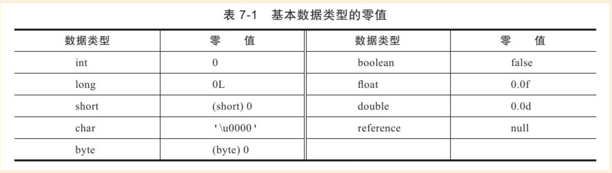

# JVM类加载的过程


## 加载

###  预加载


虚拟机启动时加载，加载的是```JAVA_HOME/lib/```下的```rt.jar```下的.class文件，这个jar包里面的内容是程序运行时非常常常用到的，像```java.lang.*、java.util.*、java.io.*```等等，因此随着虚拟机一起加载。要证明这一点很简单，写一个空的main函数，设置虚拟机参数为```-XX:+TraceClassLoading```来获取类加载信息，运行一下：

输出为：
```
[Opened /Library/Java/JavaVirtualMachines/jdk1.8.0_60.jdk/Contents/Home/jre/lib/rt.jar]
[Loaded java.lang.Object from /Library/Java/JavaVirtualMachines/jdk1.8.0_60.jdk/Contents/Home/jre/lib/rt.jar]
[Loaded java.io.Serializable from /Library/Java/JavaVirtualMachines/jdk1.8.0_60.jdk/Contents/Home/jre/lib/rt.jar]
[Loaded java.lang.Comparable from /Library/Java/JavaVirtualMachines/jdk1.8.0_60.jdk/Contents/Home/jre/lib/rt.jar]
[Loaded java.lang.CharSequence from /Library/Java/JavaVirtualMachines/jdk1.8.0_60.jdk/Contents/Home/jre/lib/rt.jar]
[Loaded java.lang.String from /Library/Java/JavaVirtualMachines/jdk1.8.0_60.jdk/Contents/Home/jre/lib/rt.jar]
[Loaded java.lang.reflect.AnnotatedElement from /Library/Java/JavaVirtualMachines/jdk1.8.0_60.jdk/Contents/Home/jre/lib/rt.jar]
[Loaded java.lang.reflect.GenericDeclaration from /Library/Java/JavaVirtualMachines/jdk1.8.0_60.jdk/Contents/Home/jre/lib/rt.jar]
....
```

### 运行时加载

虚拟机在用到一个```.class```文件的时候，会先去内存中查看一下这个```.class```文件有没有被加载，如果没有就会按照类的全限定名来加载这个类。

那么，加载阶段做了什么，其实加载阶段做了有三件事情：

获取.class文件的二进制流
将类信息、静态变量、字节码、常量这些.class文件中的内容放入方法区中
在内存中生成一个代表这个.class文件的```java.lang.Class```对象，作为方法区这个类的各种数据的访问入口。一般这个Class是在堆里的，不过HotSpot虚拟机比较特殊，这个Class对象是放在方法区中的
虚拟机规范对这三点的要求并不具体，因此虚拟机实现与具体应用的灵活度都是相当大的。例如第一条，根本没有指明二进制字节流要从哪里来、怎么来，因此单单就这一条，就能变出许多花样来：

- 从zip包中获取，这就是以后jar、ear、war格式的基础
- 从网络中获取，典型应用就是Applet
- 运行时计算生成，典型应用就是动态代理技术
- 由其他文件生成，典型应用就是JSP，即由JSP生成对应的.class文件
- 从数据库中读取，这种场景比较少见

总而言之，在类加载整个过程中，这部分是对于开发者来说可控性最强的一个阶段。

## 验证

连接阶段的第一步，这一阶段的目的是为了确保.class文件的字节流中包含的信息符合当前虚拟机的要求，并且不会危害虚拟机自身的安全。

Java语言本身是相对安全的语言（相对C/C++来说），但是前面说过，.class文件未必要从Java源码编译而来，可以使用任何途径产生，甚至包括用十六进制编辑器直接编写来产生.class文件。在字节码语言层面上，Java代码至少从语义上是可以表达出来的。虚拟机如果不检查输入的字节流，对其完全信任的话，很可能会因为载入了有害的字节流而导致系统崩溃，所以验证是虚拟机对自身保护的一项重要工作。


主要包括以下内容：

- 文件格式验证
- 元数据验证
- 字节码验证
- 符号引用验证

## 准备

准备阶段是正式为类变量分配内存并设置其初始值的阶段，这些变量所使用的内存都将在方法区中分配。关于这点，有两个地方注意一下：

1. 这时候进行内存分配的仅仅是类变量（被static修饰的变量），而不是实例变量，实例变量将会在对象实例化的时候随着对象一起分配在Java堆中
2. 这个阶段赋初始值的变量指的是那些不被final修饰的static变量，比如”public static int value = 123;”，value在准备阶段过后是0而不是123，给value赋值为123的动作将在初始化阶段才进行；比如”public static final int value = 123;”就不一样了，在准备阶段，虚拟机就会给value赋值为123。



## 解析

解析阶段是虚拟机将常量池内的符号引用替换为直接引用的过程。

### 符号引用

这个其实是属于编译原理方面的概念，符号引用包括了下面三类常量：

- 类和接口的全限定名
- 字段的名称和描述符
- 方法的名称和描述符


看下面一段代码


**源代码**
```
package com.zch.blogs.java.jvm;

public class ClassTest1 {
	private static int i;
	private double d;

	public static void print() {

	}

	private boolean trueOrFalse() {
		return false;
	}
}

```


** javap查看常量池**

```

Constant pool:
   #1 = Methodref          #3.#17         // java/lang/Object."<init>":()V
   #2 = Class              #18            // com/zch/blogs/java/jvm/ClassTest1
   #3 = Class              #19            // java/lang/Object
   #4 = Utf8               i
   #5 = Utf8               I
   #6 = Utf8               d
   #7 = Utf8               D
   #8 = Utf8               <init>
   #9 = Utf8               ()V
  #10 = Utf8               Code
  #11 = Utf8               LineNumberTable
  #12 = Utf8               print
  #13 = Utf8               trueOrFalse
  #14 = Utf8               ()Z
  #15 = Utf8               SourceFile
  #16 = Utf8               ClassTest1.java
  #17 = NameAndType        #8:#9          // "<init>":()V
  #18 = Utf8               com/zch/blogs/java/jvm/ClassTest1
  #19 = Utf8               java/lang/Object

```

可以看到，一共有19项内容，其中带”Utf8″的就是符号引用。比如#2，它的值是”com/zch/blogs/java/jvm/ClassTest1”，表示的是这个类的全限定名；又比如#4为i，#5为I，它们是一对的，表示变量时Integer（int）类型的，名字叫做i；#6为D、#7为d也是一样，表示一个Double（double）类型的变量，名字为d；#12、#13表示的都是方法的名字。

那其实总而言之，符号引用和我们上面讲的是一样的，是对于类、变量、方法的描述。符号引用和虚拟机的内存布局是没有关系的，引用的目标未必已经加载到内存中了。

### 直接引用

直接引用可以是直接指向目标的指针、相对偏移量或是一个能间接定位到目标的句柄。直接引用是和虚拟机实现的内存布局相关的，同一个符号引用在不同的虚拟机示例上翻译出来的直接引用一般不会相同。如果有了直接引用，那引用的目标必定已经存在在内存中了。

## 初始化


初始化阶段是类加载过程的最后一步，初始化阶段是真正执行类中定义的Java程序代码（或者说是字节码）的过程。初始化过程是一个执行类构造器<clinit>()方法的过程，根据程序员通过程序制定的主观计划去初始化类变量和其它资源。把这句话说白一点，其实初始化阶段做的事就是给static变量赋予用户指定的值以及执行静态代码块。

注意一下，虚拟机会保证类的初始化在多线程环境中被正确地加锁、同步，即如果多个线程同时去初始化一个类，那么只会有一个类去执行这个类的<clinit>()方法，其他线程都要阻塞等待，直至活动线程执行<clinit>()方法完毕。因此如果在一个类的<clinit>()方法中有耗时很长的操作，就可能造成多个进程阻塞。不过其他线程虽然会阻塞，但是执行<clinit>()方法的那条线程退出<clinit>()方法后，其他线程不会再次进入<clinit>()方法了，因为同一个类加载器下，一个类只会初始化一次。实际应用中这种阻塞往往是比较隐蔽的，要小心。

Java虚拟机规范严格规定了有且只有5种场景必须立即对类进行初始化，这4种场景也称为对一个类进行主动引用：

1. 使用new关键字实例化对象、读取或者设置一个类的静态字段（被final修饰的静态字段除外）、调用一个类的静态方法的时候
2. 使用java.lang.reflect包中的方法对类进行反射调用的时候
3. 初始化一个类，发现其父类还没有初始化过的时候
4. 虚拟机启动的时候，虚拟机会先初始化用户指定的包含main()方法的那个类

 
## 参考

- 深入理解Java虚拟机：JVM高级特性与最佳实践（第2版)
- [Java虚拟机 9 ：Java 类加载机制](http://www.importnew.com/28445.html)
