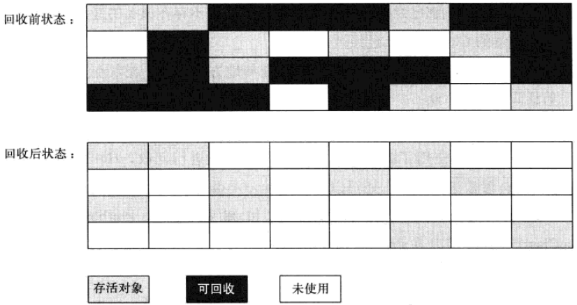
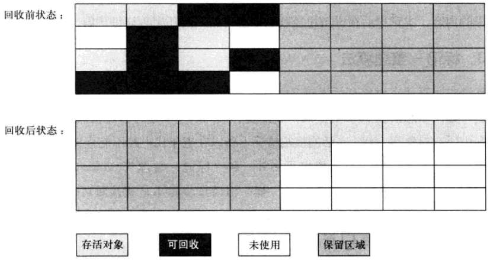
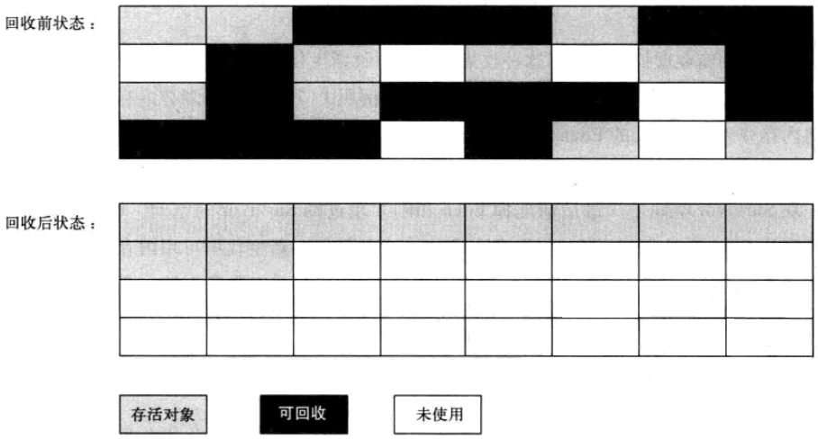
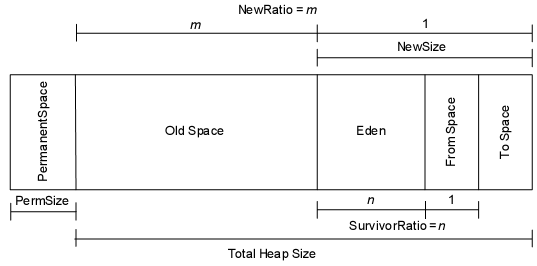

# JVM垃圾收集(GC)算法

## 标记-清除(Mark-Sweep)算法

这是最基础的算法，标记-清除算法就如同它的名字样，分为“标记”和“清除”两个阶段：首先标记出所有需要回收的对象，标记完成后统一回收所有被标记的对象。这种算法的不足主要体现在效率和空间，从效率的角度讲，标记和清除两个过程的效率都不高；从空间的角度讲，标记清除后会产生大量不连续的内存碎片， 内存碎片太多可能会导致以后程序运行过程中在需要分配较大对象时，无法找到足够的连续内存而不得不提前触发一次垃圾收集动作。标记-清除算法执行过程如图：

## 复制(Copying)算法

复制算法是为了解决效率问题而出现的，它将可用的内存分为两块，每次只用其中一块，当这一块内存用完了，就将还存活着的对象复制到另外一块上面，然后再把已经使用过的内存空间一次性清理掉。这样每次只需要对整个半区进行内存回收，内存分配时也不需要考虑内存碎片等复杂情况，只需要移动指针，按照顺序分配即可。复制算法的执行过程如图：

不过这种算法有个缺点，内存缩小为了原来的一半，这样代价太高了。现在的商用虚拟机都采用这种算法来回收新生代，不过研究表明1:1的比例非常不科学，因此新生代的内存被划分为一块较大的Eden空间和两块较小的Survivor空间，每次使用Eden和其中一块Survivor。每次回收时，将Eden和Survivor中还存活着的对象一次性复制到另外一块Survivor空间上，最后清理掉Eden和刚才用过的Survivor空间。HotSpot虚拟机默认Eden区和Survivor区的比例为8:1，意思是每次新生代中可用内存空间为整个新生代容量的90%。当然，我们没有办法保证每次回收都只有不多于10%的对象存活，当Survivor空间不够用时，需要依赖老年代进行分配担保（Handle Promotion）。

## 标记-整理(Mark-Compact)算法

复制算法在对象存活率较高的场景下要进行大量的复制操作，效率很低。万一对象100%存活，那么需要有额外的空间进行分配担保。老年代都是不易被回收的对象，对象存活率高，因此一般不能直接选用复制算法。根据老年代的特点，有人提出了另外一种标记-整理算法，过程与标记-清除算法一样，不过不是直接对可回收对象进行清理，而是让所有存活对象都向一端移动，然后直接清理掉边界以外的内存。标记-整理算法的工作过程如图：

## 分代收集算法

现代商用虚拟机基本都采用分代收集算法来进行垃圾回收。这种算法没什么特别的，无非是上面内容的结合罢了，根据对象的生命周期的不同将内存划分为几块，然后根据各块的特点采用最适当的收集算法。大批对象死去、少量对象存活的，使用复制算法，复制成本低；对象存活率高、没有额外空间进行分配担保的，采用标记-清理算法或者标记-整理算法。

