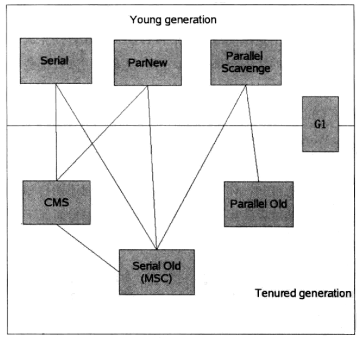

# Java常见的垃圾收集器有哪些


垃圾收集器（GC，Garbage Collector）是和具体 JVM 实现紧密相关的，不同厂商（IBM、Oracle），不同版本的 JVM，提供的选择也不同。




上图展示了7种作用于不同分代的收集器，如果两个收集器之间存在连线，那说明它们可以搭配使用。虚拟机所处的区域说明它是属于新生代收集器还是老年代收集器。多说一句，我们必须要明白一个道理：没有最好的垃圾收集器，更加没有万能的收集器，只能选择对具体应用最合适的收集器。这也是HotSpot为什么要实现这么多收集器的原因。OK，下面一个一个看一下收集器：

## Serial GC

它是最古老的垃圾收集器，“Serial”体现在其收集工作是单线程的，并且在进行垃圾收集过程中，会进入臭名昭著的“Stop-The-World”状态。当然，其单线程设计也意味着精简的 GC 实现，无需维护复杂的数据结构，初始化也简单，所以一直是 Client 模式下 JVM 的默认选项。

从年代的角度，通常将其老年代实现单独称作 Serial Old，它采用了标记-整理（Mark-Compact）算法，区别于新生代的复制算法。
Serial GC 的对应 JVM 参数是：
```
-XX:+UseSerialGC
```

## ParNew GC

很明显是个新生代 GC 实现，它实际是 Serial GC 的多线程版本，最常见的应用场景是配合老年代的 CMS GC 工作，下面是对应参数

```
-XX:+UseConcMarkSweepGC -XX:+UseParNewGC
```


## CMS（Concurrent Mark Sweep） GC

基于标记 - 清除（Mark-Sweep）算法，设计目标是尽量减少停顿时间，这一点对于 Web 等反应时间敏感的应用非常重要，一直到今天，仍然有很多系统使用 CMS GC。但是，CMS 采用的标记 - 清除算法，存在着内存碎片化问题，所以难以避免在长时间运行等情况下发生 full GC，导致恶劣的停顿。另外，既然强调了并发（Concurrent），CMS 会占用更多 CPU 资源，并和用户线程争抢。

## Parrallel GC

在早期 JDK 8 等版本中，它是 server 模式 JVM 的默认 GC 选择，也被称作是吞吐量优先的 GC。它的算法和 Serial GC 比较相似，尽管实现要复杂的多，其特点是新生代和老年代 GC 都是并行进行的，在常见的服务器环境中更加高效。
开启选项是：

```
-XX:+UseParallelGC
```

另外，Parallel GC 引入了开发者友好的配置项，我们可以直接设置暂停时间或吞吐量等目标，JVM 会自动进行适应性调整，例如下面参数：

```
-XX:MaxGCPauseMillis=value
-XX:GCTimeRatio=N // GC 时间和用户时间比例 = 1 / (N+1)
```


## G1 GC

这是一种兼顾吞吐量和停顿时间的 GC 实现，是 Oracle JDK 9 以后的默认 GC 选项。G1 可以直观的设定停顿时间的目标，相比于 CMS GC，G1 未必能做到 CMS 在最好情况下的延时停顿，但是最差情况要好很多。

G1 GC 仍然存在着年代的概念，但是其内存结构并不是简单的条带式划分，而是类似棋盘的一个个 region。Region 之间是复制算法，但整体上实际可看作是标记 - 整理（Mark-Compact）算法，可以有效地避免内存碎片，尤其是当 Java 堆非常大的时候，G1 的优势更加明显。

G1 吞吐量和停顿表现都非常不错，并且仍然在不断地完善，与此同时 CMS 已经在 JDK 9 中被标记为废弃（deprecated），所以 G1 GC 值得你深入掌握。

## 垃圾收集器总结


来看一下对垃圾收集器的总结，列了一张表

|　GC组合|　　Minor GC             |FullGC             |描述|
| - | - | - | - |
| -XX:+UseSerialGC	| Serial收集器串行回收| 	Serial Old收集器串行回收	| 该选项可以手动指定Serial收集器+Serial Old收集器组合执行内存回收|
| -XX:+UseParNewGC	| ParNew收集器并行回收| 	Serial Old收集器串行回收	| 该选项可以手动指定ParNew收集器+Serilal Old组合执行内存回收|
| -XX:+UseParallelGC| 	Parallel收集器并行回收| 	Serial Old收集器串行回收	| 该选项可以手动指定Parallel收集器+Serial Old收集器组合执行内存回收|
| -XX:+UseParallelOldGC| 	Parallel收集器并行回收| 	Parallel Old收集器并行回收	| 该选项可以手动指定Parallel收集器+Parallel Old收集器组合执行内存回收|
| -XX:+UseConcMarkSweepGC	| ParNew收集器并行回收 | 	缺省使用CMS收集器并发回收，备用采用Serial Old收集器串行回收| 该选项可以手动指定ParNew收集器+CMS收集器+Serial Old收集器组合执行内存回收。优先使用ParNew收集器+CMS收集器的组合，当出现ConcurrentMode Fail或者Promotion Failed时，则采用ParNew收集器+Serial Old收集器的组合|
| -XX:+UseConcMarkSweepGC -XX:-UseParNewGC|Serial收集器串行回收|同上|同上|
|-XX:+UseG1GC	|G1收集器并发、并行执行内存回收	|同左|暂无|


## 参考

- [Java虚拟机5：Java垃圾回收（GC）机制详解](https://www.cnblogs.com/xrq730/p/4836700.html)
