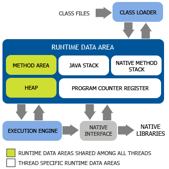

# Metaspace学习

## 被废弃的持久代

首先我们看一张JVM内存布局的图：

注意到里面有一块METHOD AREA，它是一块线程共享的对象，名为方法区，在HotSpot虚拟机中，这块METHOD AREA我们可以认为等同于持久代（PermGen），在Java 6及之前的版本，持久代存放了以下一些内容：

- 虚拟机加载的类信息
- 常量池
- 静态变量
-即时编译后的代码

到了Java 7之后，常量池已经不在持久代之中进行分配了，而是移到了堆中，即常量池和对象共享堆内存。

接着到了Java 8之后的版本，持久代已经被永久移除，取而代之的是Metaspace。

## 为什么要移除持久代

HotSpot团队选择移除持久代，有内因和外因两部分，从外因来说，我们看一下JEP 122的Motivation（动机）部分：

>This is part of the JRockit and Hotspot convergence effort. JRockit customers do not need to configure the permanent generation (since JRockit does not have a permanent generation) and are accustomed to not configuring the permanent generation.

>大致就是说移除持久代也是为了和JRockit进行融合而做的努力，JRockit用户并不需要配置持久代（因为JRockit就没有持久代）。

从内因来说，持久代大小受到-XX：PermSize和-XX：MaxPermSize两个参数的限制，而这两个参数又受到JVM设定的内存大小限制，这就导致在使用中可能会出现持久代内存溢出的问题，因此在Java 8及之后的版本中彻底移除了持久代而使用Metaspace来进行替代。

## Metaspace

上面说了，为了避免出现持久代内存溢出的问题，Java 8及之后的版本彻底移除了持久代而使用Metaspace来进行替代。

Metaspace是方法区在HotSpot中的实现，它与持久代最大的区别在于：Metaspace并不在虚拟机内存中而是使用本地内存。因此Metaspace具体大小理论上取决于32位/64位系统可用内存的大小，可见也不是无限制的，需要配置参数。

接着我们模拟一下Metaspace内存溢出的情况，前面说了持久代存放了以下信息：

- 虚拟机加载的类信息
- 常量池
- 静态变量
- 即时编译后的代码

所以最简单的模拟Metaspace内存溢出，我们只需要无限生成类信息即可，类占据的空间总是会超过Metaspace指定的空间大小的。

即使使用了Metaspace，也是有OOM的风险的，但是由于Metaspace使用本机内存，因此只要不要代码里面犯太低级的错误，OOM的概率基本是不存在的。

## Metaspace相关JVM参数

最后我们来看一下Metaspace相关的几个JVM参数：

|参数名|	作  用|
| - | - |
 |MetaspaceSize	 |初始化的Metaspace大小，控制Metaspace发生GC的阈值。GC后，动态增加或者降低MetaspaceSize，默认情况下，这个值大小根据不同的平台在12M到20M之间浮动 |
 |MaxMetaspaceSize |	限制Metaspace增长上限，防止因为某些情况导致Metaspace无限使用本地内存，影响到其他程序，默认为4096M |
 |MinMetaspaceFreeRatio	 |当进行过Metaspace GC之后，会计算当前Metaspace的空闲空间比，如果空闲比小于这个参数，那么虚拟机增长Metaspace的大小，默认为40，即70% |
 |MaxMetaspaceFreeRatio	 |当进行过Metaspace GC之后，会计算当前Metaspace的空闲空间比，如果空闲比大于这个参数，那么虚拟机会释放部分Metaspace空间，默认为70，即70% |
 |MaxMetaspaceExpanison |	Metaspace增长时的最大幅度，默认值为5M |
 |MinMetaspaceExpanison	 |Metaspace增长时的最小幅度，默认为330KB |

## 参考

- [Java虚拟机16：Metaspace](https://www.cnblogs.com/xrq730/p/8688203.html)
