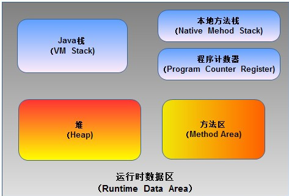
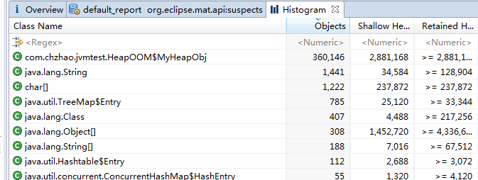

# JVM内存区域与内存溢出

## 什么是JVM
### 什么是JVM

>JVM是Java Virtual Machine（Java虚拟机）的缩写，JVM是一种用于计算设备的规范，它是一个虚构出来的计算机，是通过在实际的计算机上仿真模拟各种计算机功能来实现的。
Java语言的一个非常重要的特点就是与平台的无关性。而使用Java虚拟机是实现这一特点的关键。一般的高级语言如果要在不同的平台上运行，至少需要编译成不同的目标代码。而引入Java语言虚拟机后，Java语言在不同平台上运行时不需要重新编译。Java语言使用Java虚拟机屏蔽了与具体平台相关的信息，使得Java语言编译程序只需生成在Java虚拟机上运行的目标代码（字节码），就可以在多种平台上不加修改地运行。Java虚拟机在执行字节码时，把字节码解释成具体平台上的机器指令执行。这就是Java的能够“一次编译，到处运行”的原因。

一句话解释，JVM就是Java的运行环境。

### 常见的JVM
- **HotSpot VM**
- BEA JRockit
- IBM J9 VM
- Google Android Dalvik VM

最常见的是就是HotSpot
```
C:\Users\ChunhuiZhao>java -version
java version "1.7.0_67"
Java(TM) SE Runtime Environment (build 1.7.0_67-b01)
Java HotSpot(TM) 64-Bit Server VM (build 24.65-b04, mixed mode)

```

## 运行时数据区域
Java虚拟机在执行Java程序的过程中会把它所管理的内存划分为若干个不同的数据区域。这些区域都有各自的用途，以及创建和销毁的时间，有的区域随着虚拟机进程的启动而存在，有些区域则依赖用户线程的启动和结束而建立和销毁。根据《Java虚拟机规范（Java SE 7版）》的规定，Java虚拟机所管理的内存将会包括以下几个运行时数据区域。


### 程序计数器
程序计数器（Program Counter Register）是一块较小的内存空间，它可以看作是当前线程所执行的字节码的行号指示器。在虚拟机的概念模型里（仅是概念模型，各种虚拟机可能会通过一些更高效的方式去实现），字节码解释器工作时就是通过改变这个计数器的值来选取下一条需要执行的字节码指令，分支、循环、跳转、异常处理、线程恢复等基础功能都需要依赖这个计数器来完成。

由于Java虚拟机的多线程是通过线程轮流切换并分配处理器执行时间的方式来实现的，在任何一个确定的时刻，一个处理器（对于多核处理器来说是一个内核）都只会执行一条线程中的指令。因此，为了线程切换后能恢复到正确的执行位置，每条线程都需要有一个独立的程序计数器，各条线程之间计数器互不影响，独立存储，我们称这类内存区域为“线程私有”的内存。

此内存区域是唯一一个在Java虚拟机规范中没有规定任何OutOfMemory-Error情况的区域。
### Java虚拟机栈
与程序计数器一样，Java虚拟机栈（Java Vir-tual Machine Stacks）也是线程私有的，它的生命周期与线程相同。虚拟机栈描述的是Java方法执行的内存模型：每个方法在执行的同时都会创建一个栈帧（Stack Frame）用于存储局部变量表、操作数栈、动态链接、方法出口等信息。每一个方法从调用直至执行完成的过程，就对应着一个栈帧在虚拟机栈中入栈到出栈的过程。

局部变量表存放了编译期可知的各种基本数据类型（boolean、byte、char、short、int、float、long、double）、对象引用（reference类型，它不等同于对象本身，可能是一个指向对象起始地址的引用指针，也可能是指向一个代表对象的句柄或其他与此对象相关的位置）和returnAddress类型（指向了一条字节码指令的地址）。

在Java虚拟机规范中，对这个区域规定了两种异常：如果线程请求的栈深度大于虚拟机所允许的深度，将抛出StackOverflowError异常；如果虚拟机栈可以动态扩展（当前大部分的Java虚拟机都可动态扩展，只不过Java虚拟机规范中也允许固定长度的虚拟机栈），如果扩展时无法申请到足够的内存，就会抛出OutOfMemoryError异常。
### 本地方法栈
本地方法栈（Native Method Stack）与虚拟机栈所发挥的作用是非常相似的，它们之间的区别不过是虚拟机栈为虚拟机执行Java方法（也就是字节码）服务，而本地方法栈则为虚拟机使用到的Na-tive方法服务。在虚拟机规范中对本地方法栈中方法使用的语言、使用方式与数据结构并没有强制规定，因此具体的虚拟机可以自由实现它。甚至有的虚拟机（譬如Sun HotSpot虚拟机）直接就把本地方法栈和虚拟机栈合二为一。与虚拟机栈一样，本地方法栈区域也会抛出StackOverflowError和OutOfMemoryError异常。

### Java堆
对于大多数应用来说，Java堆（Java Heap）是Java虚拟机所管理的内存中最大的一块。Java堆是被所有线程共享的一块内存区域，在虚拟机启动时创建。此内存区域的唯一目的就是存放对象实例，几乎所有的对象实例都在这里分配内存。这一点在Java虚拟机规范中的描述是：所有的对象实例以及数组都要在堆上分配，但是随着JIT编译器的发展与逃逸分析技术逐渐成熟，栈上分配、标量替换优化技术将会导致一些微妙的变化发生，所有的对象都分配在堆上也渐渐变得不是那么“绝对”了。Java堆是垃圾收集器管理的主要区域（这部分下篇讲）。

根据Java虚拟机规范的规定，Java堆可以处于物理上不连续的内存空间中，只要逻辑上是连续的即可，就像我们的磁盘空间一样。在实现时，既可以实现成固定大小的，也可以是可扩展的，不过当前主流的虚拟机都是按照可扩展来实现的（通过-Xmx和-Xms控制）。如果在堆中没有内存完成实例分配，并且堆也无法再扩展时，将会抛出OutOfMemoryError异常。

### 方法区
方法区（Method Area）与Java堆一样，是各个线程共享的内存区域，它用于存储已被虚拟机加载的类信息、常量、静态变量、即时编译器编译后的代码等数据。虽然Java虚拟机规范把方法区描述为堆的一个逻辑部分，但是它却有一个别名叫做Non-Heap（非堆），目的应该是与Java堆区分开来。

根据Java虚拟机规范的规定，当方法区无法满足内存分配需求时，将抛出OutOfMemoryError异常。
### 运行时常量池
运行时常量池（Runtime Constant Pool）是方法区的一部分。Class文件中除了有类的版本、字段、方法、接口等描述信息外，还有一项信息是常量池（Constant Pool Table），用于存放编译期生成的各种字面量和符号引用，这部分内容将在类加载后进入方法区的运行时常量池中存放。

当常量池无法再申请到内存时会抛出OutOfMemoryError异常。

## HotSpot虚拟机对象探秘
上面讲完虚拟机运行时区域之后，本节介绍虚拟机内存中的数据的其他细节，譬如它们是如何创建、如何布局以及如何访问的。
### 对象的创建
普通对象的创建可以简化为以下步骤：
1. 检查常量池中是否有此类的符号引用。
2. 按上面的符号引用，为对象分配内存（包括很多种算法，如指针碰撞、空闲列表等，不介绍）。
3. 把上面分配的内存都初始为零。
4. 设置对象头，包括对象是哪个类的实例、对象的hashcode等。
5. 执行init方法。


### 对象的内存布局
在HotSpot虚拟机中，对象在内存中的存储包括3个部分：对象头、实例数据和对齐填充。
- 对象头：存储对象运行时数据（HashCode、GC分代年龄、锁标志位等）和类型指针（指向元数据指针）。

- 实例数据：程序代码中所定义的各种类型的字段内容。

- 对齐填充：当对象实例数据部分没有对齐时，就需要通过对齐填充来补全，没有实际意义。

### 对象的访问定位
通过直接指针访问对象


## OutOfMemoryError异常
1. 通过代码验证Java虚拟机规范中描述的各个运行时区域存储的内容；
2. 在工作中遇到实际的内存溢出异常时，能根据异常的信息快速判断是哪个区域的内存溢出，知道什么样的代码可能会导致这些区域内存溢出，以及出现这些异常后该如何处理。

### 虚拟机参数简介
- -Xms4M  *初始堆大小*
- -Xmx4M  *最大堆大小*
- -XX:+HeapDumpOnOutOfMemoryError  *表示当JVM发生OOM时，自动生成DUMP文件*
- -Xss128k *设置Stack Space大小*

### 工具介绍
MAT Eclipse Memory Analyzer
下载地址
```
https://eclipse.org/mat/downloads.php
```
参考资料
[使用 Eclipse Memory Analyzer 进行堆转储文件分析](http://www.ibm.com/developerworks/cn/opensource/os-cn-ecl-ma/)
### Java堆溢出
JVM启动参数
```
-Xms4M -Xmx4M -XX:+HeapDumpOnOutOfMemoryError
```
代码
```
package com.chzhao.jvmtest;

import java.util.ArrayList;
import java.util.List;

public class HeapOOM {
	static class MyHeapObj {
	}

	public static void main(String[] args) {
		List<MyHeapObj> list = new ArrayList<MyHeapObj>();

		for (int i = 0;; i++) {
			list.add(new MyHeapObj());
			System.out.println(i);
		}
	}
}

```
异常信息
```
360144
java.lang.OutOfMemoryError: Java heap space
Dumping heap to java_pid11428.hprof ...
Heap dump file created [11722611 bytes in 0.264 secs]
Exception in thread "main" java.lang.OutOfMemoryError: Java heap space
	at java.util.Arrays.copyOf(Unknown Source)
	at java.util.Arrays.copyOf(Unknown Source)
	at java.util.ArrayList.grow(Unknown Source)
	at java.util.ArrayList.ensureExplicitCapacity(Unknown Source)
	at java.util.ArrayList.ensureCapacityInternal(Unknown Source)
	at java.util.ArrayList.add(Unknown Source)
	at com.chzhao.jvmtest.HeapOOM.main(HeapOOM.java:14)
```
用MAT分析

### 栈溢出
JVM启动参数
```
-Xss128k
```
代码
```
package com.chzhao.jvmtest;

public class StackSOF {
	private int len = 1;

	private void leak() {
		len++;
		leak();
	}

	public static void main(String[] args) {
		StackSOF ss = new StackSOF();
		try {
			ss.leak();
		} catch (Exception e) {
			System.out.println(ss.len);
			throw e;
		}
	}
}

```
输出
```
Exception in thread "main" java.lang.StackOverflowError
	at com.chzhao.jvmtest.StackSOF.leak(StackSOF.java:7)
	at com.chzhao.jvmtest.StackSOF.leak(StackSOF.java:8)
	at com.chzhao.jvmtest.StackSOF.leak(StackSOF.java:8)
	at com.chzhao.jvmtest.StackSOF.leak(StackSOF.java:8)
	at com.chzhao.jvmtest.StackSOF.leak(StackSOF.java:8)
```
另外，多线程也会一起栈溢出，不能创建无穷线程。
