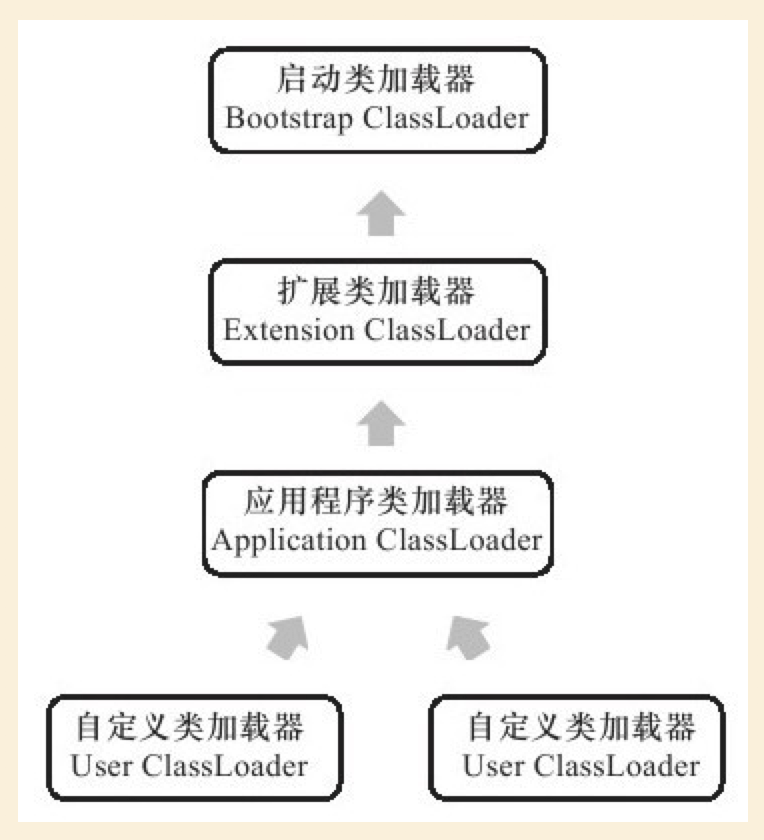

# JVM类加载器


虚拟机设计团队把类加载阶段中“通过一个类的全限定名来获取描述词类的二进制字节流”这个动作放到Java虚拟机外部去实现，以便让应用程序自己决定如何去获取所需要的类。实现这个动作的代码模块称为“类加载器”。

## 类与类加载器

类加载器虽然只用于实现类的加载动作，但它在Java程序中起到的作用却远远不限于类加载阶段。对于任意一个类，都需要由加载它的类加载器和这个类本身一同确立其在Java虚拟机中的唯一性，每一个类加载器，都拥有一个独立的类名称空间。这句话可以表达得更通俗一些：比较两个类是否“相等”，只有在这两个类是由同一个类加载器加载的前提下才有意义，否则，即使这两个类来源于同一个Class文件，被同一个虚拟机加载，只要加载它们的类加载器不同，那这两个类就必定不相等。这里所指的“相等”，包括代表类的Class对象的equals()方法、isAssignableFrom()方法、isInstance()方法的返回结果，也包括使用instanceof关键字做对象所属关系判定等情况。如果没有注意到类加载器的影响，在某些情况下可能会产生具有迷惑性的结果，如下代码演示了不同的类加载器对instanceof关键字运算的结果的影响。

```
package com.zch.blogs.java.jvm;

import java.io.IOException;
import java.io.InputStream;

public class ClassLoaderTest1 {
	public static void main(String[] args) throws Exception {
		ClassLoader myLoader = new ClassLoader() {
			@Override
			public Class<?> loadClass(String name) throws ClassNotFoundException {
				try {
					String fileName = name.substring(name.lastIndexOf(".") + 1) + ".class";
					InputStream is = getClass().getResourceAsStream(fileName);
					if (is == null) {
						return super.loadClass(name);
					}
					byte[] b = new byte[is.available()];
					is.read(b);
					return defineClass(name, b, 0, b.length);
				} catch (IOException e) {
					throw new ClassNotFoundException(name);
				}
			}
		};
		Object obj = myLoader.loadClass("com.zch.blogs.java.jvm.ClassLoaderTest1").newInstance();
		System.out.println(obj.getClass());
		System.out.println(obj instanceof com.zch.blogs.java.jvm.ClassLoaderTest1);
	}
}

```

输出

```
class com.zch.blogs.java.jvm.ClassLoaderTest1
false

```

虽然是一个class文件加载的类，但因为类加载器不一样，所以也不相等。





### 启动类加载器BootstrapClassLoader

之前说过了这是一个嵌在JVM内核中的加载器。它负责加载的是```JAVA_HOME/lib```下的类库，系统类加载器无法被Java程序直接应用

### 扩展类加载器ExtensionClassLoader

这个类加载器由```sun.misc.Launcher$ExtClassLoader```实现，它负责用于加载```JAVA_HOME/lib/ext```目录中的，或者被java.ext.dirs系统变量指定所指定的路径中所有类库，开发者可以直接使用扩展类加载器。java.ext.dirs系统变量所指定的路径的可以通过程序来查看。

源代码

```
package com.zch.blogs.java.jvm;

public class ClassTest2 {
	public static void main(String[] args) {
		System.out.println(System.getProperty("java.ext.dirs"));
	}
}

```

输出

```
/Users/zch/Library/Java/Extensions:/Library/Java/JavaVirtualMachines/jdk1.8.0_60.jdk/Contents/Home/jre/lib/ext:/Library/Java/Extensions:/Network/Library/Java/Extensions:/System/Library/Java/Extensions:/usr/lib/java

```
### 应用程序类加载器Application ClassLoader


源代码
```
package com.zch.blogs.java.jvm;

public class ClassTest3 {
	public static void main(String[] args) {
		System.out.println(ClassLoader.getSystemClassLoader());
	}
}

```

输出
```
sun.misc.Launcher$AppClassLoader@7852e922
```

## 双亲委派模型


1.如果一个类加载器收到了类加载的请求，它首先不会自己去尝试加载这个类，而是把这个请求委派给父类加载器去完成，每一个层次的类加载器都是如此。
2.只有当父加载器反馈自己无法完成这这个加载请求（它的搜索范围中没有找到所需的类）时，子加载器才会尝试自己去加载。

所以，其实所有的加载请求最终都应该传送到顶层的启动类加载器中。双亲委派模型对于Java程序的稳定运作很重要，因为Java类随着它的加载器一起具备了一种带有优先级的层次关系。例如java.lang.Object，存放于rt.jar中，无论哪一个类加载器要去加载这个类，最终都是由Bootstrap ClassLoader去加载，因此Object类在程序的各种类加载器环境中都是一个类。相反，如果没有双亲委派模型，由各个类自己去加载的话，如果用户自己编写了一个java.lang.Object，并放在CLASSPATH下，那系统中将会出现多个不同的Object类，Java体系中最基础的行为也将无法保证，应用程序也将会变得一片混乱。

双亲委派模型要求除了顶层的启动类加载器外，其余的类加载器都应当有自己的父类加载器。这里类加载器之间的父子关系一般不会以继承（Inheritance）的关系来实现，而是都使用组合（Composition）关系来复用父加载器的代码。


## 破坏双亲委派模型

## 参考

- 深入理解Java虚拟机：JVM高级特性与最佳实践（第2版)
- [Java 虚拟机10：类加载器](http://www.importnew.com/28449.html)
