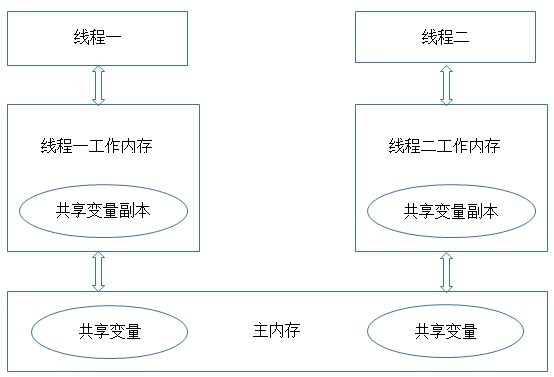
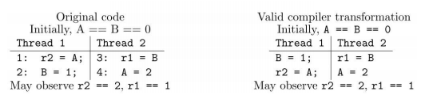

# Java并发编程核心理论

## 共享性

数据共享性是线程安全的主要原因之一。如果所有的数据只是在线程内有效，那就不存在线程安全性问题，这也是我们在编程的时候经常不需要考虑线程安全的主要原因之一。但是，在多线程编程中，数据共享是不可避免的。最典型的场景是数据库中的数据，为了保证数据的一致性，我们通常需要共享同一个数据库中数据，即使是在主从的情况下，访问的也同一份数据，主从只是为了访问的效率和数据安全，而对同一份数据做的副本。

##  互斥性

资源互斥是指同时只允许一个访问者对其进行访问，具有唯一性和排它性。我们通常允许多个线程同时对数据进行读操作，但同一时间内只允许一个线程对数据进行写操作。所以我们通常将锁分为共享锁和排它锁，也叫做读锁和写锁。如果资源不具有互斥性，即使是共享资源，我们也不需要担心线程安全。例如，对于不可变的数据共享，所有线程都只能对其进行读操作，所以不用考虑线程安全问题。但是对共享数据的写操作，一般就需要保证互斥性，上述例子中就是因为没有保证互斥性才导致数据的修改产生问题。Java 中提供多种机制来保证互斥性，最简单的方式是使用Synchronized。

## 原子性

原子性就是指对数据的操作是一个独立的、不可分割的整体。换句话说，就是一次操作，是一个连续不可中断的过程，数据不会执行的一半的时候被其他线程所修改。保证原子性的最简单方式是操作系统指令，就是说如果一次操作对应一条操作系统指令，这样肯定可以能保证原子性。但是很多操作不能通过一条指令就完成。例如，对long类型的运算，很多系统就需要分成多条指令分别对高位和低位进行操作才能完成。还比如，我们经常使用的整数 i++ 的操作，其实需要分成三个步骤：（1）读取整数 i 的值；（2）对 i 进行加一操作；（3）将结果写回内存。

这也是代码段一执行的结果为什么不正确的原因。对于这种组合操作，要保证原子性，最常见的方式是加锁，如Java中的Synchronized或Lock都可以实现，代码段二就是通过Synchronized实现的。除了锁以外，还有一种方式就是CAS（Compare And Swap），即修改数据之前先比较与之前读取到的值是否一致，如果一致，则进行修改，如果不一致则重新执行，这也是乐观锁的实现原理。不过CAS在某些场景下不一定有效，比如另一线程先修改了某个值，然后再改回原来值，这种情况下，CAS是无法判断的。(ABA问题)

## 可见性

要理解可见性，需要先对JVM的内存模型有一定的了解，JVM的内存模型与操作系统类似，如图所示：

从这个图中我们可以看出，每个线程都有一个自己的工作内存（相当于CPU高级缓冲区，这么做的目的还是在于进一步缩小存储系统与CPU之间速度的差异，提高性能），对于共享变量，线程每次读取的是工作内存中共享变量的副本，写入的时候也直接修改工作内存中副本的值，然后在某个时间点上再将工作内存与主内存中的值进行同步。这样导致的问题是，如果线程1对某个变量进行了修改，线程2却有可能看不到线程1对共享变量所做的修改。

。Java 中可通过Synchronized或Volatile来保证可见性。

## 有序性

为了提高性能，编译器和处理器可能会对指令做重排序。重排序可以分为三种：

　　（1）编译器优化的重排序。编译器在不改变单线程程序语义的前提下，可以重新安排语句的执行顺序。

　　（2）指令级并行的重排序。现代处理器采用了指令级并行技术（Instruction-Level Parallelism， ILP）来将多条指令重叠执行。如果不存在数据依赖性，处理器可以改变语句对应机器指令的执行顺序。
　　（3）内存系统的重排序。由于处理器使用缓存和读/写缓冲区，这使得加载和存储操作看上去可能是在乱序执行。

　　我们可以直接参考一下JSR 133 中对重排序问题的描述：

　　

先看上图中的（1）源码部分，从源码来看，要么指令 1 先执行要么指令 3先执行。如果指令 1 先执行，r2不应该能看到指令 4 中写入的值。如果指令 3 先执行，r1不应该能看到指令 2 写的值。但是运行结果却可能出现r2==2，r1==1的情况，这就是“重排序”导致的结果。上图（2）即是一种可能出现的合法的编译结果，编译后，指令1和指令2的顺序可能就互换了。因此，才会出现r2==2，r1==1的结果。Java 中也可通过Synchronized或Volatile来保证顺序性。

## 参考

- [Java 并发编程：核心理论 ](https://www.cnblogs.com/paddix/p/5374810.html)
