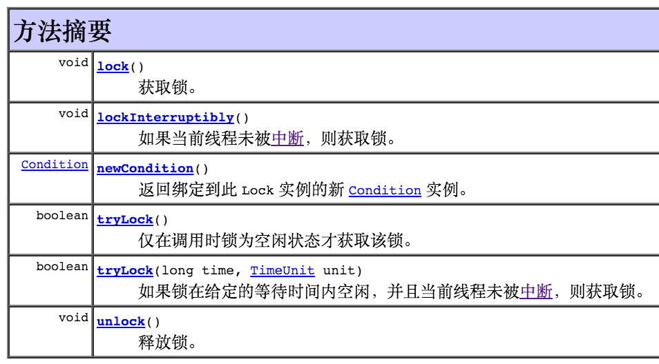

# ReentrantLock基本用法

Java里面提供了比synchronized更加灵活丰富的锁机制，它们有一个共同的接口Lock，我们先来学习这个接口，了解其协议和功能。下面是JDK文档，总结得非常精炼，包含的知识点非常多，所以一开始可能看不懂，不过没关系，后面一点点弄懂。

## lock接口

Lock 实现提供了比使用 synchronized 方法和语句可获得的更广泛的锁定操作。此实现允许更灵活的结构，可以具有差别很大的属性，可以支持多个相关的 Condition 对象。

锁是控制多个线程对共享资源进行访问的工具。通常，锁提供了对共享资源的独占访问。一次只能有一个线程获得锁，对共享资源的所有访问都需要首先获得锁。不过，某些锁可能允许对共享资源并发访问，如 ReadWriteLock 的读取锁。

虽然 synchronized 方法和语句的范围机制使得使用监视器锁编程方便了很多，而且还帮助避免了很多涉及到锁的常见编程错误，但有时也需要以更为灵活的方式使用锁。例如，某些遍历并发访问的数据结果的算法要求使用 “hand-over-hand” 或 “chain locking”：获取节点 A 的锁，然后再获取节点 B 的锁，然后释放 A 并获取 C，然后释放 B 并获取 D，依此类推。Lock 接口的实现允许锁在不同的作用范围内获取和释放，并允许以任何顺序获取和释放多个锁，从而支持使用这种技术。

随着灵活性的增加，也带来了更多的责任。不使用块结构锁就失去了使用 synchronized 方法和语句时会出现的锁自动释放功能。

Lock 实现提供了使用 synchronized 方法和语句所没有的其他功能，包括提供了一个非块结构的获取锁尝试 (tryLock())、一个获取可中断锁的尝试 (lockInterruptibly()) 和一个获取超时失效锁的尝试 (tryLock(long, TimeUnit))。

Lock 类还可以提供与隐式监视器锁完全不同的行为和语义，如保证排序、非重入用法或死锁检测。如果某个实现提供了这样特殊的语义，则该实现必须对这些语义加以记录。

lock接口定义的方法如下：



在```java.util.concurrent.locks```包下面有以下几个类实现了lock接口。

- ReadWriteLock
- ReentrantLock
- ReentrantReadWriteLock
- StampedLock  StampedLock 对吞吐量有巨大的改进，

## 使用ReentrantLock进行同步

一个可重入的互斥锁 Lock，它具有与使用 synchronized 方法和语句所访问的隐式监视器锁相同的一些基本行为和语义，但功能更强大。

ReentrantLock 将由最近成功获得锁，并且还没有释放该锁的线程所拥有。当锁没有被另一个线程所拥有时，调用 lock 的线程将成功获取该锁并返回。如果当前线程已经拥有该锁，此方法将立即返回。可以使用 isHeldByCurrentThread() 和 getHoldCount() 方法来检查此情况是否发生。


```


    /**
     * Queries the number of holds on this lock by the current thread.
     *
     * <p>A thread has a hold on a lock for each lock action that is not
     * matched by an unlock action.
     *
     * <p>The hold count information is typically only used for testing and
     * debugging purposes. For example, if a certain section of code should
     * not be entered with the lock already held then we can assert that
     * fact:
     *
     *  <pre> {@code
     * class X {
     *   ReentrantLock lock = new ReentrantLock();
     *   // ...
     *   public void m() {
     *     assert lock.getHoldCount() == 0;
     *     lock.lock();
     *     try {
     *       // ... method body
     *     } finally {
     *       lock.unlock();
     *     }
     *   }
     * }}</pre>
     *
     * @return the number of holds on this lock by the current thread,
     *         or zero if this lock is not held by the current thread
     */
    public int getHoldCount() {
        return sync.getHoldCount();
    }

```

```
/**
 * Returns an estimate of the number of threads waiting to
 * acquire this lock.  The value is only an estimate because the number of
 * threads may change dynamically while this method traverses
 * internal data structures.  This method is designed for use in
 * monitoring of the system state, not for synchronization
 * control.
 *
 * @return the estimated number of threads waiting for this lock
 */
public final int getQueueLength() {
    return sync.getQueueLength();
}
```


## 代码示例

```
package com.zch.blogs.java.multithreads.lock;

import java.util.concurrent.locks.ReentrantLock;

/**
 * @Description 普通的ReentrantLock例子。
 * @author zch
 * @time 2018年9月6日 上午11:13:08
 *
 */
public class ReentrantLockDemo0 {
	public final static ReentrantLock lock = new ReentrantLock();

	public static void main(String[] args) {
		ThreadClass0 tc1 = new ThreadClass0();
		Thread t1 = new Thread(tc1, "t1");
		Thread t2 = new Thread(tc1, "t2");
		Thread t3 = new Thread(tc1, "t3");
		Thread t4 = new Thread(tc1, "t4");
		Thread t5 = new Thread(tc1, "t5");

		t1.start();
		t2.start();
		t3.start();
		t4.start();
		t5.start();

	}

}

class ThreadClass0 implements Runnable {

	@Override
	public void run() {
		ReentrantLockClass0.foo();
	}

}

class ReentrantLockClass0 {
	static void foo() {

		ReentrantLockDemo0.lock.lock();
		try {
			for (int i = 0; i < 3; i++) {
				Thread.sleep(10);
				System.out.println(Thread.currentThread().getName() + " " + i);
			}
			int count = ReentrantLockDemo0.lock.getHoldCount();
			int queuedLength = ReentrantLockDemo0.lock.getQueueLength();
			System.out.println(Thread.currentThread().getName() + " getHoldCount = " + count);
			System.out.println(Thread.currentThread().getName() + " getQueueLength = " + queuedLength);
		} catch (InterruptedException e) {
			e.printStackTrace();
		} finally {
			ReentrantLockDemo0.lock.unlock();
		}
	}
}

```

输出

```
t1 0
t1 1
t1 2
t1 getHoldCount = 1
t1 getQueueLength = 4
t4 0
t4 1
t4 2
t4 getHoldCount = 1
t4 getQueueLength = 3
t3 0
t3 1
t3 2
t3 getHoldCount = 1
t3 getQueueLength = 2
t2 0
t2 1
t2 2
t2 getHoldCount = 1
t2 getQueueLength = 1
t5 0
t5 1
t5 2
t5 getHoldCount = 1
t5 getQueueLength = 0

```

## 参考

- [Thread详解13：ReentrantLock的用法（一）](https://blog.csdn.net/cds86333774/article/details/51025245)
