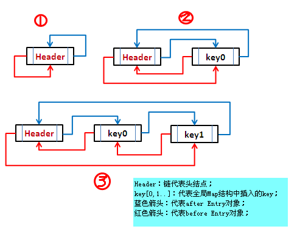

# LinkedHashMap源码学习

## 简介

LinkedHashMap 是HashMap的一个子类，保存了记录的插入顺序，在用Iterator遍历LinkedHashMap时，先得到的记录肯定是先插入的.也可以在构造时用带参数，按照应用次数排序。在遍历的时候会比HashMap慢，不过有种情况例外，当HashMap容量很大，实际数据较少时，遍历起来可能会比 LinkedHashMap慢，因为LinkedHashMap的遍历速度只和实际数据有关，和容量无关，而HashMap的遍历速度和他的容量有关。

##  结构

## 参考

- [LinkedHashMap 的实现原理](http://wiki.jikexueyuan.com/project/java-collection/linkedhashmap.html)
