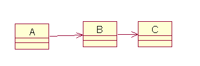
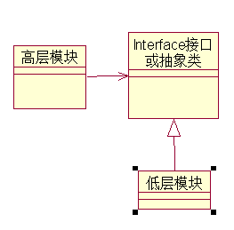

# 设计模式重要原则

## 1：单一职责原则（Single Responsibilit Principle），简称：SRP

SRP准确解释：就一个类而言，应该仅有一个引起它变化的原因，如果一个类承担的职责过多，就等于把这些职责都耦合在一起，一个职责的变化可能会消弱或者抑制这个类完成其他职责的能力，这种耦合会导致脆弱的设计，当变化发生时，设计会遭到意想不到的破坏，当然软件设计真正要做的许多内容，就是发现职责并把这些职责相互分离，

生活实例1：软件工程中的高内聚低耦合是软件设计的标准，我们要协调后各个功能之间的关系，各自负责好自己的功能，管好自己的事就好，例如:台式机主机箱的各个零部件就是很好的体现着以原则，这样电脑出现问题后我们很容易的去维护。

## 2：开发—封闭原则（The Open_Closeed Principle，简称OCP）

OCP是说软件实体（类、模块、函数等），应该可以扩展，但是不可修改，特征：对于扩展是开发的（Open for extension）,另一个是说对于更改是封闭的（Closed for modification），在设计的时候，时刻要考虑，尽量让这个类是足够就好了，写好了就不要去修改了。

如果新的需求来了，我们需要增加一些类即可，不允许修改的是抽象的类或者接口,允许扩展的是具体的实现类,抽象类和接口在"开-闭"原则中扮演着极其重要的角色，即要预知可能变化的需求.又预见所有可能已知的扩展，所以在这里"抽象化"是关键!

无论模块时多么封闭，都会存在以下无法封闭的变化，既然不可能完全封闭，可以通过构造抽象来隔离这些变化。

OCP是面向对象设计的核心所在，遵循这个原则可以带来面向对象技术所声称的巨大好处，也就是可维护性、可扩展性、可复用性、灵活性，但是我们应该把握好一个度就是不抽象和抽象本身一样重要。

## 3：依赖倒转原则（Dependence Inversion Principle简称：DIP）

依赖倒转原则是抽象不应该依赖细节，细节应该依赖抽象，说白了，就是对接口编程，不要对实现编程，物理主板、CPU、内存、硬盘都要是针对接口设计的，总的来说：高层模块不应该依赖低层模块，两个都应该依赖对象，抽象不应该依赖细节，细节应该依赖抽象。具体一点就是接口或抽象类，只有接口稳定，那么任何一个的更改对不用担心其他受到影响，这使得无论高层模块还是低层模块都可以很容易的实现复用，这才是最好的方法。

生活实例1：米老师有事情想通知给大家，不能够给每个人说一遍吧，那样太不现实了，所以通过各期的班长，就很容易的下达通知，老师是要依赖各期的班长，也就是说细节要依赖抽象。

生活实例2：工厂里要批量组装电脑，工人们都是依据图纸来学习的，也是细节依赖抽象的。

## 4：里氏代换原则（Liskov Substitution Principle，简称LSP）

这一原则是对继承的一种约束，是一个软件实体如果使用的是一个父类的话，那么一定使用于其子类，而且它察觉不出父类对象和子类对象的区别，也就是说，在软件里面，把父类都替换成它的子类，程序的行为没有变化，简而言之，子类型必须替换掉它们的父类型。

这个原则，使得继承复用成为了可能，只有当子类可以替换掉父类，软件单位功能不受影响时，父类才能真正的被复用，而子类能够在父类的基础上增加新的行为，子类的可替换性使得使用父类类型的模块在无需修改的情况下就可以扩展

## 5：迪米特法则（Law of Demeter,简称：LoD）

迪米特法则：如果两个类不必彼此之间通信，那么这两个类就不应当发生直接的相互作用，如果其中一个类需要调用另一个类的某一个方法的话，可以通过第三周转发这个调用。

迪米特法首先强调的前提是在类的结构设计上，每一个类应当尽量降低成员的访问权限，也就是说，一个类包装好自己的private方法，不需要让别的类知道的字段或行为就不要公开，迪米特的根本思想是强调了类之间的耦合，类之间的耦合越弱，越有利于复用，一个处在弱耦合的类被修改，不会对有关系的类造成波及，即信息的隐藏促进了软件的复用

生活实例1：A依赖B，B依赖C,，当修改A类时要考虑对类B的影响，而B类受到的影响要考虑对C类的影响，等等，如果很多类之间这么的关联，什么时候是个尽头

生活实例2：就是我们程序好中模块与模块之间的实现关系时，通过接口传递消息，这就是迪米特法则的很好体现

## 6：合成和聚合复用原则（Composition Aggregation Principle,简称：CARP）

合成（Composition）和聚合（Aggregation）都是关联（Association）的特殊种类。聚合表示整体和部分的关系，表示“拥有”；合成则是一种更强的“拥有”，部分和整体的生命周期一样。合成的新的对象完全支配其组成部分，包括它们的创建和湮灭等。一个合成关系的成分对象是不能与另一个合成关系共享的。

合成聚合是has a de 的关系，继承是is a 的关系，由于继承是、中父类变化，子类比变，所以我们一般不要用继承，优先使用合成聚合复用原则，有注意保持每个类的封装，降低继承的层次。

## 参考

- [深入浅出—设计模式重要原则](https://blog.csdn.net/ecocn/article/details/8288095)
