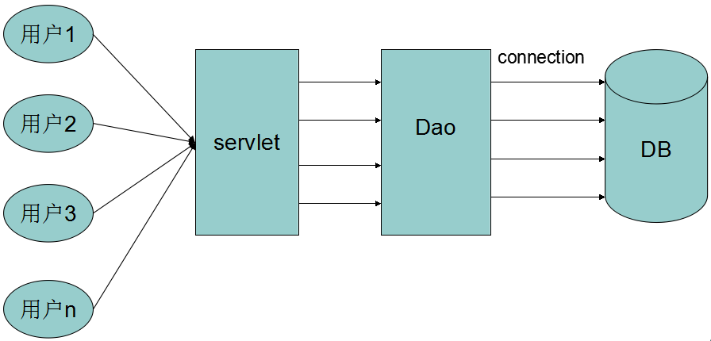
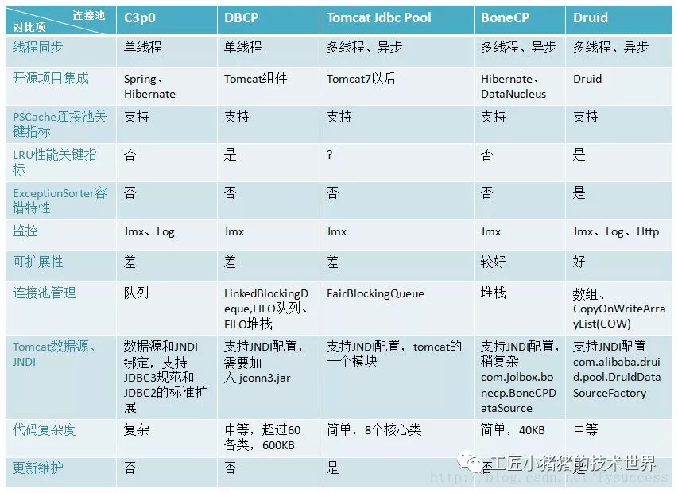
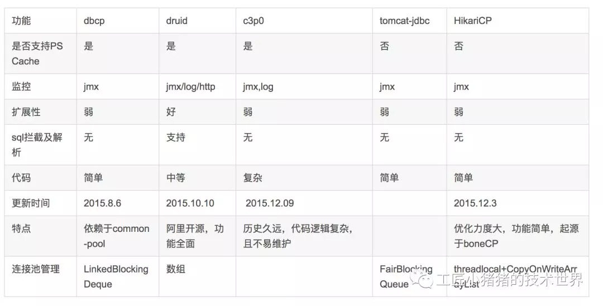
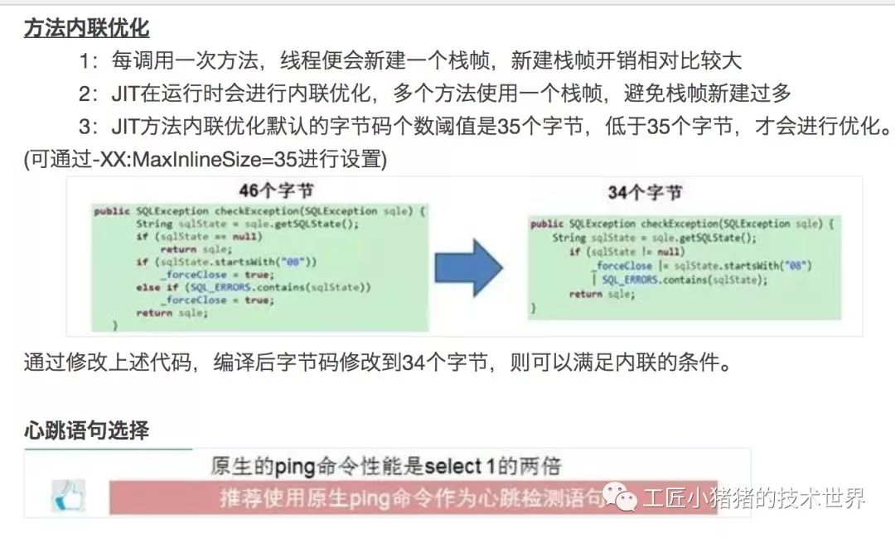
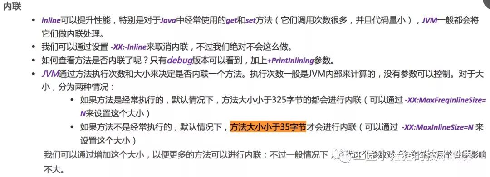
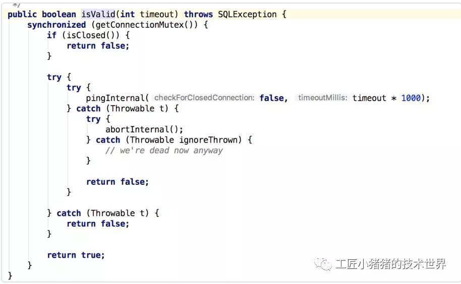
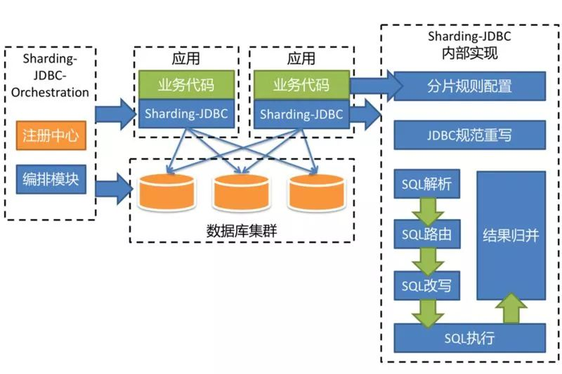
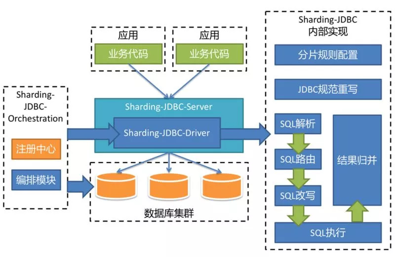
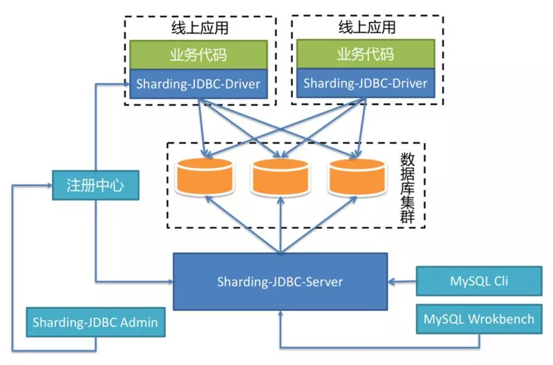
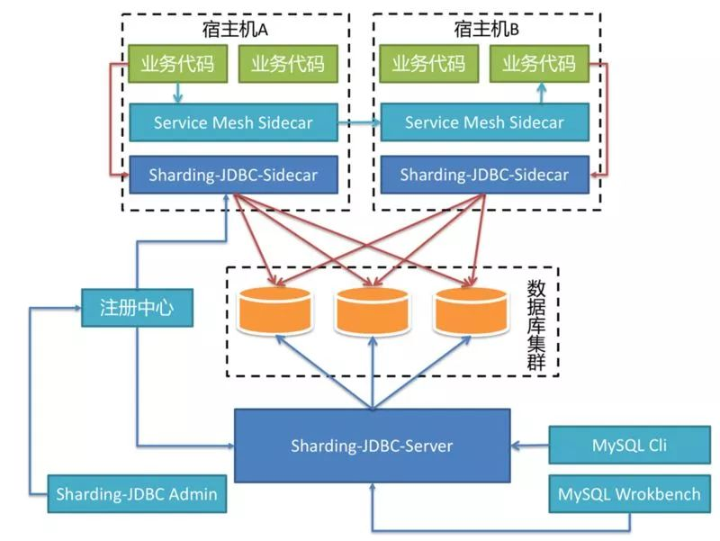

# Mysql数据库连接池学习

## 数据库连接池基本概念

### 数据库连接创建过程

最原始的数据库操作方式就是jvm加载数据库驱动然后建立连接，在一系列数据库操作之后关闭数据库连接。Java通过JDBC将数据库抽象成为对象，然后对该对象进行操作。数据库是本身存在的，不需要Java进行创建，我们要做的只是将一个正常运行的数据库实例在我们的Java程序中进行访问。

外部程序要被Java访问首先一点，该外部程序要有被Java调用的接口，并且有符合Java命名规则的类名。Java接口就是被JVM控制程序行为的Java驱动器，也就是JDBC。该接口是由数据库厂商提供的，所以类名也是由数据库厂商提供，像MySQL的命名为：com.sql.jdbc.Driver。

forName：

1. 当程序运行之后，该接口的类名以及以及句柄会记录到该程序的进程信息中；
2. forName传入该类名之后会到操作系统中找到具有该类名的线程，找到对应的线程就会找到该线程对应的驱动器，然后就将该驱动器加载到JVM中；
3. 之后就可以在Java程序中通过类名调用该进程的功能。

forName加载完成后会发现这是个数据库类的驱动，之后会进行一些特殊操作。JDBC是用DriverManager类管理数据库驱动，而且DriverManager只用来管理JDBC驱动。加载完成的数据驱动会抽象成Java类型保存在DriverManager的静态变量driver中。JDBC规定，一个Java进程只能有一个JDBC驱动，而且数据库访问也是要先建立连接。

之后DriverManager的静态同步方法getConnection方法利用driver建立与数据库的连接，返回值是一个Connection对象，Java程序通过该对象对数据库进行操作。

### 应用程序直接获取数据库连接的缺点
　　用户每次请求都需要向数据库获得链接，而数据库创建连接通常需要消耗相对较大的资源，创建时间也较长。假设网站一天10万访问量，数据库服务器就需要创建10万次连接，极大的浪费数据库的资源，并且极易造成数据库服务器内存溢出、拓机。如下图所示：

　　

### 数据库连接池的基本概念

数据库连接是一种关键的有限的昂贵的资源,这一点在多用户的网页应用程序中体现的尤为突出.对数据库连接的管理能显著影响到整个应用程序的伸缩性和健壮性,影响到程序的性能指标.数据库连接池正式针对这个问题提出来的.数据库连接池负责分配,管理和释放数据库连接,它允许应用程序重复使用一个现有的数据库连接,而不是重新建立一个。如下图所示：

　　　

数据库连接池在初始化时将创建一定数量的数据库连接放到连接池中, 这些数据库连接的数量是由最小数据库连接数来设定的.无论这些数据库连接是否被使用,连接池都将一直保证至少拥有这么多的连接数量.连接池的最大数据库连接数量限定了这个连接池能占有的最大连接数,当应用程序向连接池请求的连接数超过最大连接数量时,这些请求将被加入到等待队列中.

       数据库连接池的最小连接数和最大连接数的设置要考虑到以下几个因素:

- 最小连接数:是连接池一直保持的数据库连接,所以如果应用程序对数据库连接的使用量不大,将会有大量的数据库连接资源被浪费.
- 最大连接数:是连接池能申请的最大连接数,如果数据库连接请求超过次数,后面的数据库连接请求将被加入到等待队列中,这会影响以后的数据库操作
- 如果最小连接数与最大连接数相差很大:那么最先连接请求将会获利,之后超过最小连接数量的连接请求等价于建立一个新的数据库连接.不过,这些大于最小连接数的数据库连接在使用完不会马上被释放,他将被放到连接池中等待重复使用或是空间超时后被释放.

### 为什么需要数据库连接池

数据库连接是一种关键的、有限的、昂贵的资源，这一点在多用户的网页应用程序中体现得尤为突出。对数据库连接的管理能显著影响到整个应用程序的伸缩性和健壮性，影响到程序的性能指标。数据库连接池正是针对这个问题提出来的。

数据库连接池负责分配、管理和释放数据库连接，它允许应用程序重复使用一个现有的数据库连接，而不是再重新建立一个；释放空闲时间超过最大空闲时间的数据库连接来避免因为没有释放数据库连接而引起的数据库连接遗漏。这项技术能明显提高对数据库操作的性能。
我感觉这东西和线程池好像，就像使用线程池实现伪异步io一样主要功能就是复用。

 
## 主流数据库连接池

常用的主流开源数据库连接池有C3P0、DBCP、Tomcat Jdbc Pool、BoneCP、Druid等。

### C3p0

开源的JDBC连接池，实现了数据源和JNDI绑定，支持JDBC3规范和JDBC2的标准扩展。目前使用它的开源项目有Hibernate、Spring等。单线程，性能较差，适用于小型系统，代码600KB左右。

### DBCP (Database Connection Pool)

由Apache开发的一个Java数据库连接池项目， Jakarta commons-pool对象池机制，Tomcat使用的连接池组件就是DBCP。单独使用dbcp需要3个包：common-dbcp.jar,common-pool.jar,common-collections.jar，预先将数据库连接放在内存中，应用程序需要建立数据库连接时直接到连接池中申请一个就行，用完再放回。单线程，并发量低，性能不好，适用于小型系统。

### Tomcat Jdbc Pool

Tomcat在7.0以前都是使用common-dbcp做为连接池组件，但是dbcp是单线程，为保证线程安全会锁整个连接池，性能较差，dbcp有超过60个类，也相对复杂。Tomcat从7.0开始引入了新增连接池模块叫做Tomcat jdbc pool，基于Tomcat JULI，使用Tomcat日志框架，完全兼容dbcp，通过异步方式获取连接，支持高并发应用环境，超级简单核心文件只有8个，支持JMX，支持XA Connection。

### BoneCP
官方说法BoneCP是一个高效、免费、开源的Java数据库连接池实现库。设计初衷就是为了提高数据库连接池性能，根据某些测试数据显示，BoneCP的速度是最快的，要比当时第二快速的连接池快25倍左右，完美集成到一些持久化产品如Hibernate和DataNucleus中。BoneCP特色：高度可扩展，快速；连接状态切换的回调机制；允许直接访问连接；自动化重置能力；JMX支持；懒加载能力；支持XML和属性文件配置方式；较好的Java代码组织，100%单元测试分支代码覆盖率；代码40KB左右。

### Druid

Druid是Java语言中最好的数据库连接池，Druid能够提供强大的监控和扩展功能，是一个可用于大数据实时查询和分析的高容错、高性能的开源分布式系统，尤其是当发生代码部署、机器故障以及其他产品系统遇到宕机等情况时，Druid仍能够保持100%正常运行。主要特色：为分析监控设计；快速的交互式查询；高可用；可扩展；Druid是一个开源项目，源码托管在github上。

## 主流连接池各项功能对比

## HikariCP

我们再看一组有HikariCP的

HikariCP性能分析：

- HikariCP通过优化(concurrentBag，fastStatementList )集合来提高并发的读写效率。
- HikariCP使用threadlocal缓存连接及大量使用CAS的机制，最大限度的避免lock。单可能带来cpu使用率的上升。
- 从字节码的维度优化代码。 (default inline threshold for a JVM running the server Hotspot compiler is 35 bytecodes ）让方法尽量在35个字节码一下，来提升jvm的处理效率。
HikariCP做的优化补充如下：

mysql connecter 源码里用的就是ping命令

## 比HikariCP更快的数据库连接池

一个同事告诉我，比hikari还快的连接池他也用过、研究过 https://github.com/mauricio/postgresql-async 这是scala生态圈的东西。用netty实现了mysql协议，没用mysql官方的connector，纯异步的，它的连接池是写的比较随便，但是性能依然很好。

## 前瞻，未来到底是HikariCP还是Druid的天下？

很多人都在问，站在巨人肩膀上的第二代连接池HikariCP和druid到底孰强孰弱？其实我觉得这是一个不必讨论的问题。

我们先来看看未来的趋势：单机的操作系统将会被抛弃，取而代之的是容器调度加编排的云操作系统。裸机或者虚拟机的运行时也将会被容器取代。通信方面将会使用Service Mesh。

也就是说中间件最后的趋势一定是弱化到无感知，这才是最终的一个大道至简的方向。那些maven依赖问题，把二方库写在pom里，监控等代码的硬编码进应用里都将逐渐弱化到不复存在，取而代之的那些java agent（如pinpoint、skywalking之类），抑或是service mesh这种side car模式都是可以做中间件（包括连接池）的监控的。

一个有赞的朋友告诉我，在有赞核心应用，用HikariCP替换durid后，RT出现断崖式下滑（1.5ms ～ 1.2ms） 并且持续稳定毛刺少。性能测试与压测之后，一核心系统与druid相比，性能提高一倍左右。

阿飞做了如下统计工作，都是基于最新tag统计的，只统计java文件和xml文件，druid(alibaba-druid)总行数:430289，HikariCP(brettwooldridge-HikariCP)总行数:18372。 只统计java代码，druid(alibaba-druid)总行数:428749，HikariCP(brettwooldridge-HikariCP)总行数:17556。 再过滤一下test目录，(alibaba-druid)总行数:215232，(brettwooldridge-HikariCP)总行数:7960。 光一个DruidDataSource就3000行，且不说性能，druid是在jdbc的基础上，自己编码做得增强。

如果这么说，druid准确的说是生活在第一代和第二代连接池的面向过程的年代。druid可能忘了松耦合这个概念，把监控和数据库连接池做在一个项目里，本身就是紧耦合。既然微服务提倡业务隔离性，那么这种难道不应该隔离么？让组件工具一次只做一件事不好么？监控的事情在service mesh的将来毕竟是有别的其天然的监控手法的而不是硬编码在一个小小的连接池里。综上所述，放在现在或是未来的趋势去拼，大概率比不过拥抱springboot 2.0以及大道至简精简到极致的HikariCP。

未来的中间件，一定是和spring生态圈和servich mesh一样，大道至简，越来越薄，升级中间件不再是需要用户强行升级maven依赖解决依赖冲突，而是通过mesh的方式极致到升级让业务方无感知。所以那些热部署、潘多拉boot、容器隔离等解决依赖冲突的妥协方式也将可能大概率被置换掉。

## 从Sharding-jdbc架构演进看未来

Database Mesh，一个搭乘 Service Mesh 浪潮衍生出来的新兴词汇。顾名思义，Database Mesh 使用一个啮合层，将散落在系统各个角落中的数据库统一治理起来。通过啮合层集中在一起的应用与数据库之间的交互网络，就像蜘蛛网一样复杂而有序。它的首要目标并非啮合存储于数据库中的数据，而是啮合应用与数据库间的交互。

Database Mesh 的关注重点在于如何将分布式的数据访问应用与数据库有机串联起来，它更加关注的是交互，是将杂乱无章的应用与数据库之间的交互有效的梳理。
使用 Database Mesh，访问数据库的应用和数据库终将形成一个巨大的网格体系，应用和数据库只需在网格体系中对号入座即可，它们都是被啮合层所治理的对象。
Sharding-JDBC 一直以来，以 JDBC 层分片作为其核心理念。它的架构图如下：

Sharding-JDBC 将分别实现 Driver、Server 以及 Sidecar 这三个不同的版本，一起组成 Sharding-JDBC 的生态圈，为不同的需求与环境提供更加具有针对性的差异化服务。

由于 Sharding-JDBC-Server 的出现，使得原来 DBA 通过 Sharding-JDBC-Driver 无法对数据进行操作的缺憾得到了补偿。由于 Sharding-JDBC-Driver 无需通过代理层进行二次转发，因此线上性能更佳，可以通过以下的混合部署方案使用 Sharding-JDBC:

线上应用使用 Sharding-JDBC-Driver 直连数据库以获取最优性能，使用 MySQL 命令行或 UI 客户端连接 Sharding-JDBC-Server 方便的查询数据和执行各种 DDL 语句。它们使用同一个注册中心集群，通过管理端配置注册中心中的数据，即可由注册中心自动将配置变更推送至 Driver 和 Server 应用。若数据库拆分的过多而导致连接数会暴涨，则可以考虑直接在线上使用 Sharding-JDBC-Server，以达到有效控制连接数的目的。
在不久的将来，Sharding-JDBC-Sidecar 也将问世，它的部署架构是这样的：

基于 Sharding-JDBC 的 Database Mesh 与 Service Mesh 互不干扰，相得益彰。服务之间的交互由 Service Mesh Sidecar 接管，基于 SQL 的数据库访问由 Sharding-JDBC-Sidecar 接管。
对于业务应用来说，无论是 RPC 还是对数据库的访问，都无需关注其真实的物理部署结构，做到真正的零侵入。由于 Sharding-JDBC-Sidecar 是随着宿主机的生命周期创建和消亡的，
因此，它并非静态 IP，而是完全动态和弹性的存在，整个系统中并无任何中心节点的存在。对于数据运维等操作，仍然可以通过启动一个 Sharding-JDBC-Server 的进程作为静态 IP 的入口，通过各种命令行或 UI 客户端进行操作。

## 参考

- [主流Java数据库连接池比较及前瞻]()
- [数据库连接池](https://blog.csdn.net/qq_34448345/article/details/79347387)
- [javaweb学习总结(三十九)——数据库连接池](http://www.cnblogs.com/xdp-gacl/p/4002804.html)
- [JDBC连接数据库（二）——连接池](https://www.cnblogs.com/xiaotiaosi/p/6398371.html)
- 
