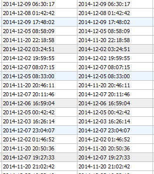

# mysql数据库中查询时间


项目中要对数据按时间处理，在数据库中，时间处理的格式如

2014-12-09 06:30:17
时间查询出来如下所示：



现在要查询具体有哪天的数据，应用substring函数，SQL如下：
```
select distinct substring(( start_time ) from 1 for 10) as t from perf_service_msg;
```
查询结果如下：

```
+------------+
| t          |
+------------+
| 2014-12-08 |
| 2014-12-05 |
| 2014-11-20 |
| 2014-12-02 |
| 2014-12-07 |
| 2014-12-06 |
| 2014-12-03 |
| 2014-12-04 |
| 2014-11-21 |
+------------+
9 rows in set

```

MYSQL中SUBSTRING的说明：

```
 SUBSTR(str,pos), SUBSTR(str FROM pos), SUBSTR(str,pos,len), SUBSTR(str FROM pos FOR len)

SUBSTR() is a synonym for SUBSTRING().

 SUBSTRING(str,pos), SUBSTRING(str FROM pos), SUBSTRING(str,pos,len), SUBSTRING(str FROM pos FOR len)

The forms without a len argument return a substring from string str starting at position pos. The forms with a len argument return a substring len characters long from string str, starting at position pos. The forms that use FROM are standard SQL syntax. It is also possible to use a negative value for pos. In this case, the beginning of the substring is pos characters from the end of the string, rather than the beginning. A negative value may be used for pos in any of the forms of this function.

For all forms of SUBSTRING(), the position of the first character in the string from which the substring is to be extracted is reckoned as 1.

mysql> SELECT SUBSTRING('Quadratically',5);
        -> 'ratically'
mysql> SELECT SUBSTRING('foobarbar' FROM 4);
        -> 'barbar'
mysql> SELECT SUBSTRING('Quadratically',5,6);
        -> 'ratica'
mysql> SELECT SUBSTRING('Sakila', -3);
        -> 'ila'
mysql> SELECT SUBSTRING('Sakila', -5, 3);
        -> 'aki'
mysql> SELECT SUBSTRING('Sakila' FROM -4 FOR 2);
        -> 'ki'
This function is multibyte safe.

If len is less than 1, the result is the empty string.
```
## 参考

http://dev.mysql.com/doc/refman/5.0/en/string-functions.html#function_substr
