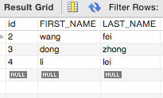
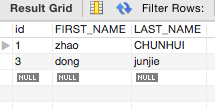
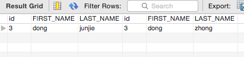
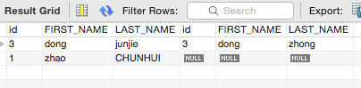
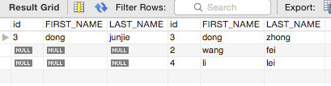
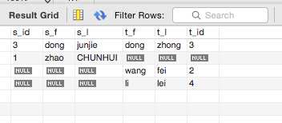

# sql的join用法


SQL join 用于把来自两个或多个表的行结合起来，sql join主要包括inner join、 left join 、right join 、full outer join。

## 数据

先介绍一下表里面的数据。

第一张表 teacher



第二张表 student




## inner join

首先是inner join，sql如下

```
select * from student as s inner join teacher as t on s.id = t.id;
```

执行结果



解释图


## left join


left join，又可以写作left outer join ，sql如下
```
select * from student as s left join teacher as t on s.id = t.id;

```
执行结果



解释图


## right join

right join，又可以写作right outer join，sql如下
```
select * from student as s right join teacher as t on s.id = t.id;
```
执行结果



解释


## full outer join

full outer join，mysql不支持full outer join，sql应该写成
```
SELECT
    s.id AS s_id,
    s.FIRST_NAME AS s_f,
    s.LAST_NAME AS s_l,
    t.FIRST_NAME AS t_f,
    t.LAST_NAME AS t_l,
    t.id AS t_id
FROM
    student AS s
        LEFT JOIN
    teacher AS t ON s.id = t.id
UNION SELECT
    s.id AS s_id,
    s.FIRST_NAME AS s_f,
    s.LAST_NAME AS s_l,
    t.FIRST_NAME AS t_f,
    t.LAST_NAME AS t_l,
    t.id AS t_id
FROM
    teacher AS t
        LEFT JOIN
    student AS s ON s.id = t.id

```

输出结果



解释


## 参考

http://www.w3cschool.cc/sql/sql-join.html

http://stackoverflow.com/questions/38549/difference-between-inner-and-outer-joins

http://www.codeproject.com/Articles/33052/Visual-Representation-of-SQL-Joins

http://stackoverflow.com/questions/4796872/full-outer-join-in-mysql
