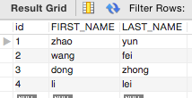
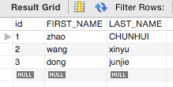
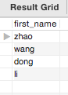
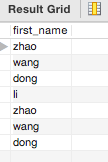
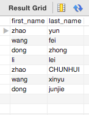

# sql中union的用法


sql中union是很常见的，尤其是创建视图时，完全离不开union。

SQL UNION 操作符合并两个或多个 SELECT 语句的结果，UNION 内部的每个 SELECT 语句必须拥有相同数量的列。列也必须拥有相似的数据类型。同时，每个 SELECT 语句中的列的顺序必须相同。

union包括union和union all两种语法，如下：

## SQL UNION 语法

```
SELECT column_name(s) FROM table1
UNION
SELECT column_name(s) FROM table2;
```

## SQL UNION ALL 语法

```
SELECT column_name(s) FROM table1
UNION ALL
SELECT column_name(s) FROM table2;
```
两者的区别就是union all包括重复的数据。

## 实例

说完了语法，下面以一个简单的例子介绍下。

### 数据

先说表结构，很简单，两张表

teacher



student.



可以看到，两张表的表结构是一样的。

现在进行对first_name的union查询。
```
select first_name from teacher union select first_name from student;
```
查询结果如下：



可以看到没有重复的数据。

改为union all之后。
```
select first_name from teacher union all select first_name from student;
```
查询结果如下：



可以看到，数据是重复的。

但如果同时查询first_name和last_name呢？
```
select first_name, last_name from teacher union select  first_name, last_name from student;
```
结果如下：



改为union all之后
```
select first_name, last_name from teacher union all select  first_name, last_name from student;
```
查询结果：


可以看到，结果是一样的，因为first_name和last_name在一起的话判断的话，没有重复的数据。


## 参考

http://www.w3cschool.cc/sql/sql-union.html
