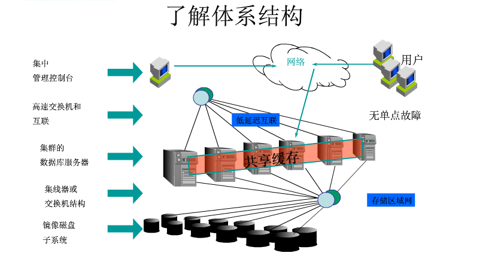
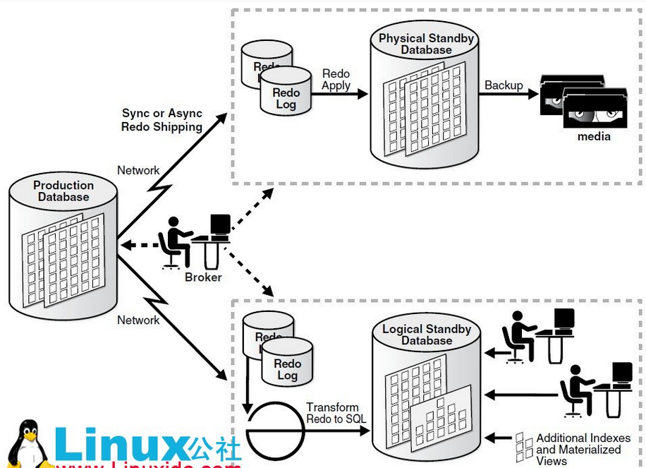
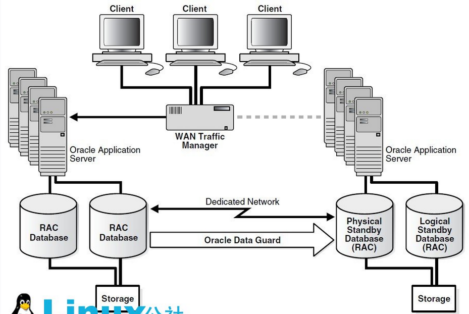
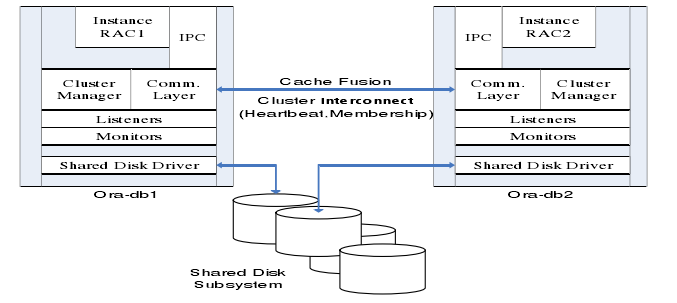
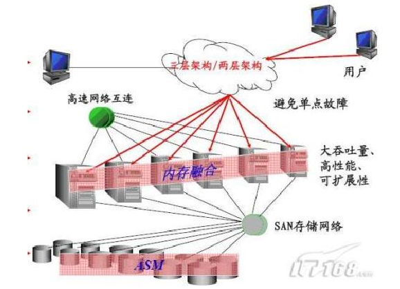
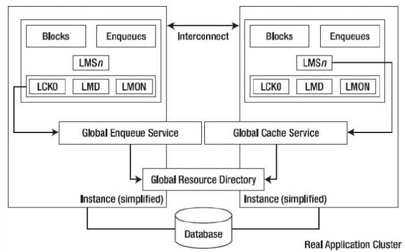

# Oracle RAC学习

## Oracle 的三种高可用集群方案

### RAC（Real Application Clusters）

多个 Oracle 服务器组成一个共享的 Cache，而这些 Oracle 服务器共享一个基于网络的存储。这个系统可以容忍单机/或是多机失败。不过系统内部的多个节点需要高速网络互连，基本上也就是要全部东西放在在一个机房内，或者说一个数据中心内。如果机房出故障，比如网络不通，那就坏了。所以仅仅用 RAC 还是满足不了一般互联网公司的重要业务的需要，重要业务需要多机房来容忍单个机房的事故。

### Data Guard（最主要的功能是冗灾）

Data Guard 这个方案就适合多机房的。某机房一个 production 的数据库，另外其他机房部署 standby 的数据库。Standby 数据库分物理的和逻辑的。物理的standby数据库主要用于 production 失败后做切换。而逻辑的 standby 数据库则在平时可以分担 production 数据库的读负载。

### MAA

MAA(Maximum Availability Architecture)其实不是独立的第三种，而是前面两种的结合，来提供最高的可用性。每个机房内部署 RAC 集群，多个机房间用 Data Guard 同步。

## RAC 概述
共享存储文件系统（NFS），或甚至集群文件系统（如：OCFS2）主要被用于存储区域网络（所有节点直接访问共享文件系统上存储器），这就使得节点失效而不影响来自其他节点对文件系统的访问，通常，共享磁盘文件系统用于高可用集群。

Oracle RAC 的核心是共享磁盘子系统，集群中所有节点必须能够访问所有数据、重做日志文件、控制文件和参数文件，数据磁盘必须是全局可用的，允许所有节点访问数据库，每个节点有它自己的重做日志和控制文件，但是其他节点必须能够访问它们以便在那个节点出现系统故障时能够恢复。

Oracle RAC 运行于集群之上，为 Oracle 数据库提供了最高级别的可用性、可伸缩性和低成本计算能力。如果集群内的一个节点发生故障，Oracle 将可以继续在其余的节点上运行。Oracle 的主要创新是一项称为高速缓存合并的技术。高速缓存合并使得集群中的节点可以通过高速集群互联高效地同步其内存高速缓存，从而最大限度地低降低磁盘 I/O。高速缓存最重要的优势在于它能够使集群中所有节点的磁盘共享对所有数据的访问。数据无需在节点间进行分区。Oracle 是唯一提供具备这一能力的开放系统数据库的厂商。其它声称可以运行在集群上的数据库软件需要对数据库数据进行分区，显得不切实际。企业网格是未来的数据中心，构建于由标准化商用组件构成的大型配置之上，其中包括：处理器、网络和存储器。Oracle RAC 的高速缓存合并技术提供了最高等级的可用性和可伸缩性。Oracle 数据库 10g 和 OracleRAC 10g 显著降低了运营成本，增强了灵活性，从而赋予了系统更卓越的适应性、前瞻性和灵活性。动态提供节点、存储器、CPU 和内存可以在实现所需服务级别的同时，通过提高的利用率不断降低成本。

## RAC 集成集群件管理

Oracle RAC 10g 在 Oracle 数据库 10g 运行的所有平台上提供了一个完整集成的集群件管理解决方案。这一集群件功能包括集群连接、消息处理服务和锁定、集群控制和恢复，以及一个工作负载管理框架（将在下文探讨）。Oracle RAC 10g 的集成集群件管理具有以下优势：

- 成本低。Oracle 免费提供这一功能。
- 单一厂商支持。消除了相互推诿的问题。
- 安装、配置和持续维护更简单。Oracle RAC 10g 集群件使用标准 Oracle 数据库管理工具进行安装、配置和维护。这一过程无须其它的集成步骤。
- 所有平台，质量始终如一。与第三方产品相比，Oracle 对新软件版本进行了更严格的测试。
- 所有平台，功能始终如一。例如，一些第三方集群件产品限制了集群内可以支持的节点的数量。借助Oracle RAC 10g，所有平台可以支持多达 64 个节点。用户还可以在所有平台上获得一致的响应体验，从而有效解决了高可用性挑战，包括服务器节点故障、互连故障以及 I/O 隔离现象等。
- 支持高级功能。这包括集成监视和通知功能，从而在发生故障时，在数据库和应用层之间实现快速协调的恢复。

## RAC 的体系结构

RAC 是 Oracle 数据库的一个群集解决方案，是有着两个或者两个以上的数据库节点协调运作能力的。如下图所示的 RAC 结构图：

集群管理器（Cluster Manager）在集群系统中对其他各个模块进行整合，通过高速的内连接来提供群集节点之间的通信。各节点之间内连接使用心跳线互联，心跳线上的信息功能确定群集逻辑上的节点成员信息和节点更新情况，以及节点在某个时间点的运行状态，保证群集系统正常运行。通信层管理节点之间的通信。它的职责是配置，互联群集中节点信息，在群集管理器中使用由心跳机制产生的信息，由通信层负责传输，确保信息的正确到达。还有一些群集监视进程不断验证系统的不同领域运行状况。例如，心跳监测不断验证的心跳机制的运作是否良好。在一个应用环境当中，所有的服务器使用和管理同一个数据库，目的是分散每一台服务器的工作量。硬件上至少需要两台以上的服务器，而且还需要一个共享存储设备；同时还需要两类软件，一类是集群软件，另外一类就是 Oracle 数据库中的 RAC 组件。同时所有服务器上的 OS 都应该是同一类 OS，根据负载均衡的配置策略，当一个客户端发送请求到某一台服务的 listener 后，这台服务器根据负载均衡策略，会把请求发送给本机的 RAC组件处理，也可能会发送给另外一台服务器的 RAC 组件处理，处理完请求后，RAC 会通过群集软件来访问共享存储设备。逻辑结构上看，每一个参加群集的节点有一个独立的实例，这些实例访问同一个数据库。节点之间通过集群软件的通信层（Communication Layer）来进行通信。同时为了减少 I/O 的消耗，存在一个全局缓存服务，因此每一个数据库的实例，都保留了一份相同的数据库 cache。RAC 中的特点如下：

每一个节点的实例都有自己的 SGA
每一个节点的实例都有自己的后台进程
每一个节点的实力都有自己的 redo logs
每一个节点的实例都有自己的 undo 表空间
所有节点都共享一份 datafiles 和 controlfiles

## RAC 的结构组成和机制

在 Oracle9i 之前，RAC 称为 OPS（Oracle Parallel Server）。RAC 与 OPS 之间的一个较大区别是，RAC 采用了Cache Fusion（高缓存合并）技术，节点已经取出的数据块更新后没有写入磁盘前，可以被另外一个节点更新，然后以最后的版本写入磁盘。在 OPS 中，节点间的数据请求需要先将数据写入磁盘，然后发出请求的节点才可以读取该数据。使用 Cache Fusion 时，RAC 的各个节点间数据缓冲区通过高速、低延迟的内部网络进行数据块的传输。下图是一个典型的 RAC 对外服务的示意图，一个 Oracle RAC Cluster 包含了如下的部分

- 集群的节点（Cluster node）——2 个到 N 个节点或者主机运行 Oracle Database Server。
- 私有网络（Network Interconnect）——RAC 之间需要一个高速互联的私有网络来处理通信和 Cache Fusion。
- 共享存储（shared Storage）——RAC 需要共享存储设备让所有的节点都可以访问数据文件。
- 对外服务的网络（Production Network）——RAC 对外服务的网络。客户端和应用都通过这个网络来访问。

## RAC 后台进程
Oracle RAC 有一些自己独特的后台进程，在单一实例中不发挥配置作用。如下图所示，定义了一些 RAC 运行的后台进程。这些后台进程的功能描述如下。

LMS（Global cache service processes 全局缓存服务进程）进程主要用来管理集群内数据块的访问，并在不同实例的 Buffer Cache 中传输数据块镜像。直接从控制的实例的缓存复制数据块，然后发送一个副本到请求的实例上。并保证在所有实例的 Buffer Cache 中一个数据块的镜像只能出现一次。LMS 进程靠着在实例中传递消息来协调数据块的访问，当一个实例请求数据块时，该实例的 LMD 进程发出一个数据块资源的请求，该请求指向主数据块的实例的 LMD 进程，主实例的 LMD 进程和正在使用的实例的 LMD 进程释放该资源，这时拥有该资源的实例的 LMS 进程会创建一个数据块镜像的一致性读然后把该数据块传递到请求该资源的实例的BUFFER CACHE 中。LMS 进程保证了在每一时刻只能允许一个实例去更新数据块，并负责保持该数据块的镜像记录（包含更新数据块的状态 FLAG)。RAC 提供了 10 个 LMS 进程（0~9），该进程数量随着节点间的消息传递的数据的增加而增加。（2）LMON（Lock Monitor Process，锁监控进程）是全局队列服务监控器，各个实例的 LMON 进程会定期通信，以检查集群中各个节点的健康状况，当某个节点出现故障时，负责集群重构、GRD 恢复等操作，它提供的服务叫做 Cluster Group Service（CGS）。

LMON 主要借助两种心跳机制来完成健康检查。

- 节点间的网络心跳（NETWORK HEARTBEAT）：可以想象成节点间定时的发送 ping 包检测节点状态，如果能在规定时间内收到回应，就认为对方状态正常。
- 通过控制文件的磁盘心跳（CONTROLFILE HEARTBEAT）：每个节点的 CKPT 进程每隔 3 秒钟更新一次控制文件的数据块，这个数据块叫做 Checkpoint Progress Record，控制文件是共享的，所以实例间可以互相检查对方是否及时更新来判断。
- LMD（THE GLOBAL ENQUEUE SERVICE DAEMON，锁管理守护进程）是一个后台进程，也被称为全局的队列服务守护进程，因为负责对资源的管理要求来控制访问块和全局队列。在每一个实例的内部，LMD 进程管理输入的远程资源请求（即来自集群中其他实例的锁请求）。此外，它还负责死锁检查和监控转换超时。
- LCK（THE LOCK PROCESS，锁进程）管理非缓存融合，锁请求是本地的资源请求。LCK 进程管理共享资源的实例的资源请求和跨实例调用操作。在恢复过程中它建立一个无效锁元素的列表，并验证锁的元素。由于处理过程中的 LMS 锁管理的首要职能，只有一个单一的 LCK 进程存在每个实例中。
- DIAG（THE DIAGNOSABILITY DAEMON，诊断守护进程）负责捕获 RAC 环境中进程失败的相关信息。并将跟踪信息写出用于失败分析，DIAG 产生的信息在与 Oracle Support 技术合作来寻找导致失败的原因方面是非常有用的。每个实例仅需要一个 DIAG 进程。
- GSD（THE GLOBAL SERVICE DAEMON，全局服务进程）与 RAC 的管理工具 dbca、srvctl、oem 进行交互，用来完成实例的启动关闭等管理事务。为了保证这些管理工具运行正常必须在所有的节点上先start gsd，并且一个 GSD 进程支持在一个节点的多个 rac.gsd 进程位$ORACLE_HOME/bin 目录下，其 log 文件为$ORACLE_HOME/srvm/log/gsdaemon.log。GCS 和 GES 两个进程负责通过全局资源目录（Global Resource Directory GRD）维护每个数据的文件和缓存块的状态信息。当某个实例访问数据并缓存了数据之后，集群中的其他实例也会获得一个对应的块镜像，这样其他实例在访问这些数据是就不需要再去读盘了，而是直接读取 SGA 中的缓存。GRD 存在于每个活动的 instance 的内存结构中，这个特点造成 RAC 环境的 SGA 相对于单实例数据库系统的 SGA 要大。其他的进程和内存结构都跟单实例数据库差别不大。

## RAC 共享存储

RAC 需要有共享存储，独立于实例之外的信息，如上面提到的ocr 和 votedisk 以及数据文件都存放在这个共享存储里的。有OCFS、OCFS2、RAW、NFS、ASM 等这样的一些存储方式。OCFS（Oracle Cluster File System） 和 OCFS2 就是一个文件系统而已，和 NFS 一样，提供一种集群环境中的共享存储的文件系统。RAW 裸设备也是一种存储方式，是 oracle11g 之前的版本中 RAC 支持的存储方式，在 Oralce9i 之前，OPS/RAC的支持只能使用这样的方式，也就是把共享存储映射到 RAW Device，然后把 Oracle 需要的数据选择 RAW device存储，但是 RAW 相对于文件系统来说不直观，不便于管理，而且 RAW Device 有数量的限制，RAW 显然需要有新的方案来代替，这样就有了 OCFS 这样的文件系统。当然，这只是 Oracle 自己的实现的集文件系统而已，还有其他厂商提供的文件系统可以作为存储的选择方案。ASM 只是数据库存储的方案而已，并不是 cluster 的方案，所以这里 ASM 应该是区别于 RAW 和 OCFS/OCFS2同一级别的概念，RAW 和 OCFS/OCFS2 不仅可以作为数据库存储的方案，同时也可以作为 Clusterware 里的存储方案，是 CRS 里需要的 storage，而 ASM 仅作为数据库的存储而已，严格来说仅是 RAC 中的一个节点应用（nodeapps）。

## 参考

- [Oracle 集群概念和原理](http://wiki.jikexueyuan.com/project/oraclecluster/oracle-cluster-concept.html)
- [Oracle RAC](https://baike.baidu.com/item/Oracle%20RAC/6542374)
