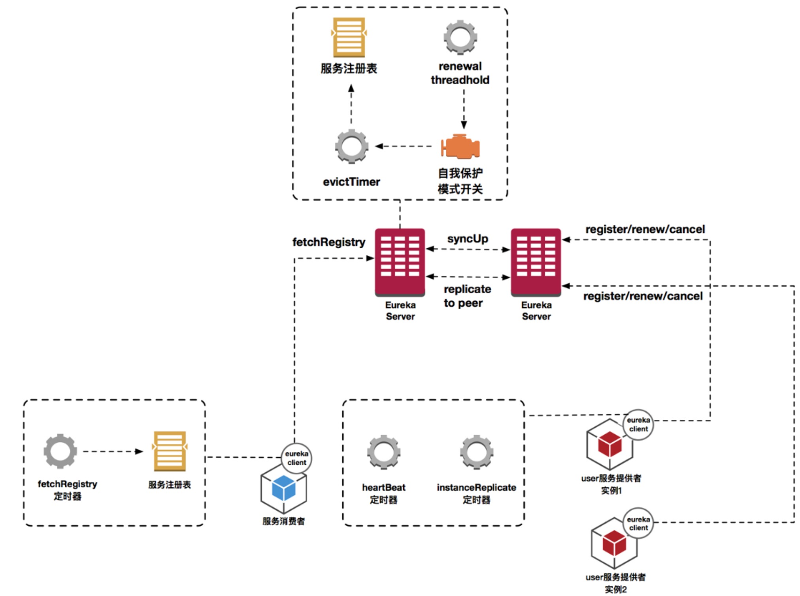
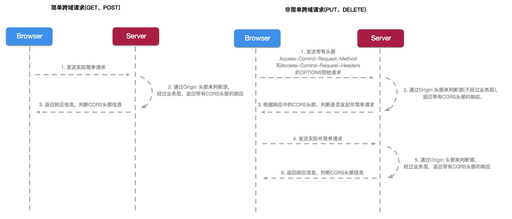
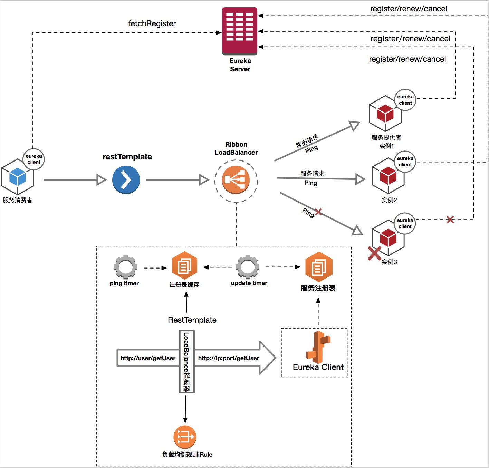
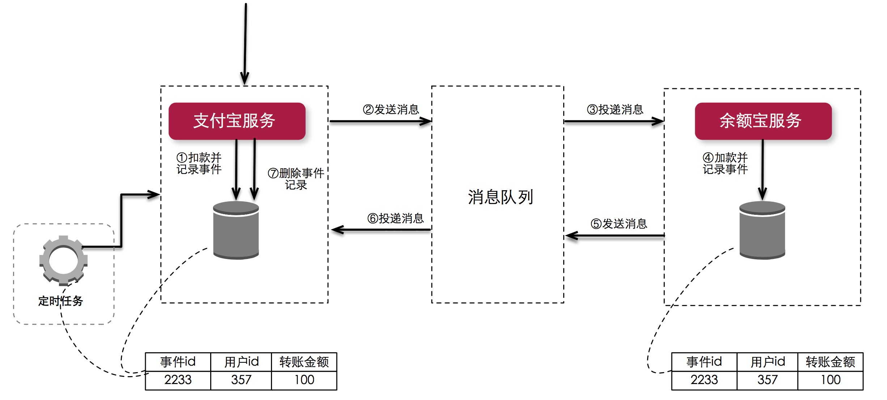
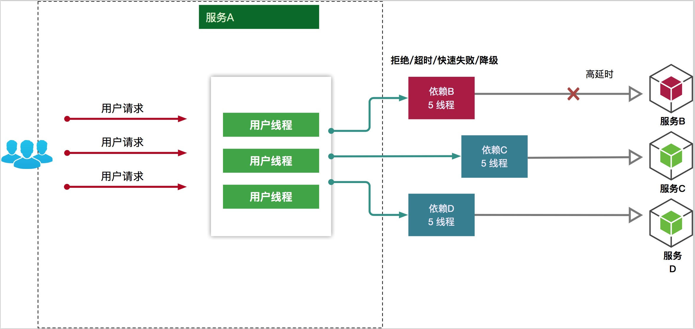
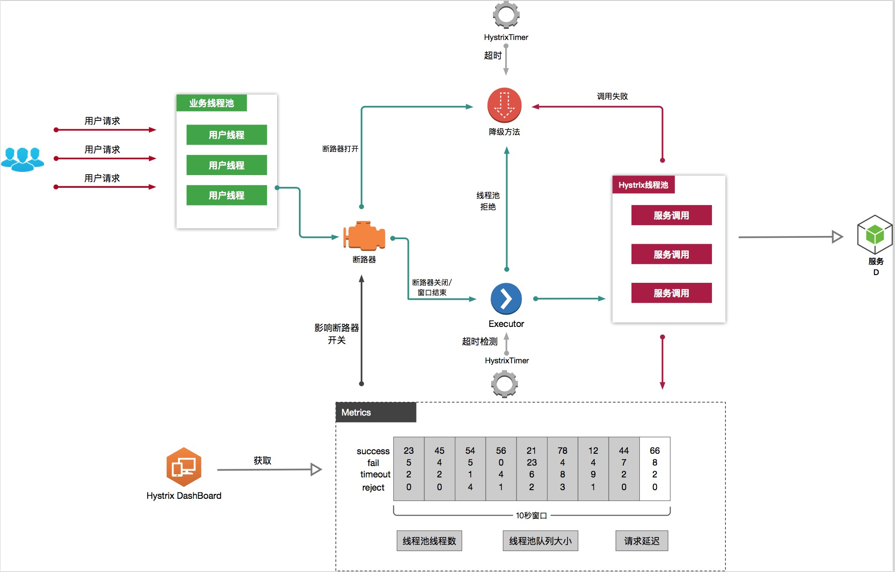
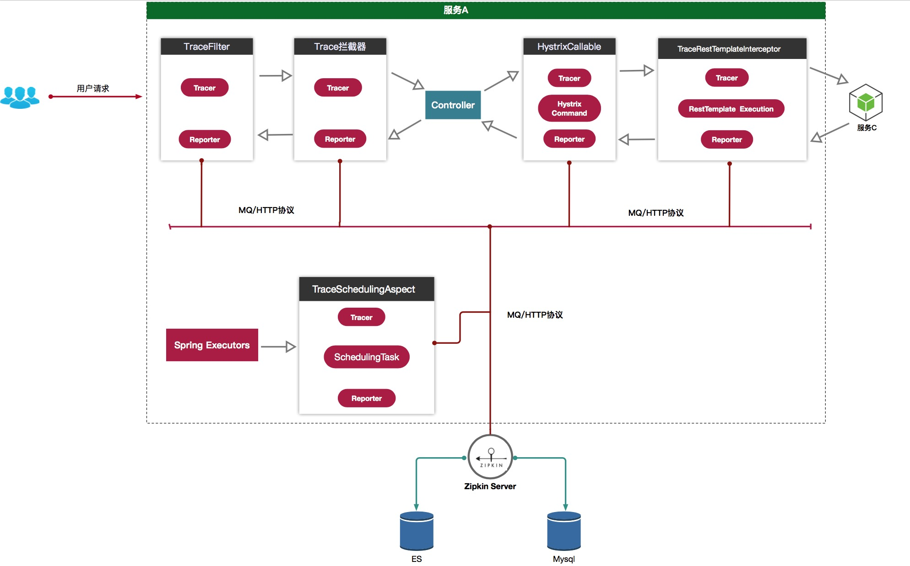
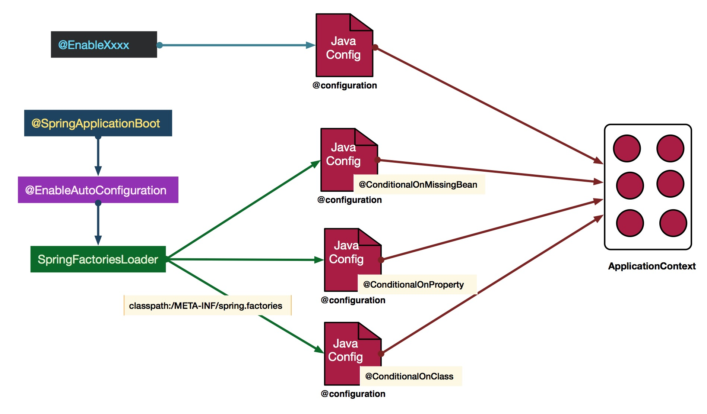

# SpringCloud实现原理图

## 服务注册发现组件Eureka工作原理

## 服务网关组件Zuul工作原理

## 跨域时序图

## Eureka与Ribbon整合工作原理

## 解决分布式一致性

## 级联故障流程

## 断路器组件Hystrix工作原理

## 分布式追踪Sleuth工作原理

## SpringBoot自动配置工作原理

## 参考

- [面试必问的SpringCloud实现原理图](https://www.imooc.com/article/23679)
