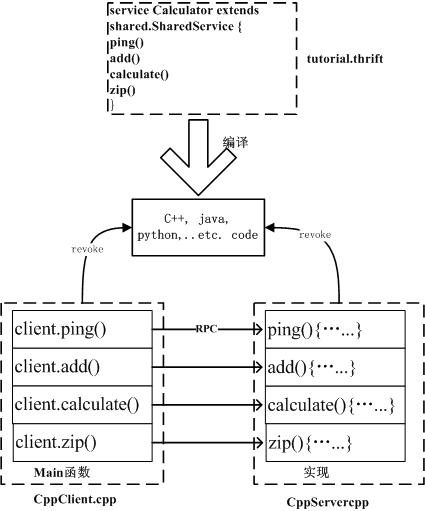
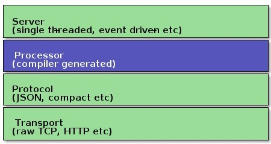

# Thrift 的原理和使用

## Thrift 架构
Thrift是一个跨语言的服务部署框架，最初由Facebook于2007年开发，2008年进入Apache开源项目。Thrift通过IDL（Interface Definition Language，接口定义语言）来定义RPC（Remote Procedure Call，远程过程调用）的接口和数据类型，然后通过thrift编译器生成不同语言的代码（目前支持C++,Java, Python, PHP, Ruby, Erlang, Perl, Haskell, C#, Cocoa, Smalltalk和OCaml），并由生成的代码负责RPC协议层和传输层的实现。

PS：CentOS下的Thrift的安装流程可以参考这里。


### Thrift架构


图中，TProtocol（协议层），定义数据传输格式，例如：

TBinaryProtocol：二进制格式；
TCompactProtocol：压缩格式；
TJSONProtocol：JSON格式；
TSimpleJSONProtocol：提供JSON只写协议, 生成的文件很容易通过脚本语言解析；
TDebugProtocol：使用易懂的可读的文本格式，以便于debug
TTransport（传输层），定义数据传输方式，可以为TCP/IP传输，内存共享或者文件共享等）被用作运行时库。

TSocket：阻塞式socker；
TFramedTransport：以frame为单位进行传输，非阻塞式服务中使用；
TFileTransport：以文件形式进行传输；
TMemoryTransport：将内存用于I/O，java实现时内部实际使用了简单的ByteArrayOutputStream；
TZlibTransport：使用zlib进行压缩， 与其他传输方式联合使用，当前无java实现；


Thrift支持的服务模型

TSimpleServer：简单的单线程服务模型，常用于测试；
TThreadPoolServer：多线程服务模型，使用标准的阻塞式IO；
TNonblockingServer：多线程服务模型，使用非阻塞式IO（需使用TFramedTransport数据传输方式）；


Thrift实际上是实现了C/S模式，通过代码生成工具将thrift文生成服务器端和客户端代码（可以为不同语言），从而实现服务端和客户端跨语言的支持。用户在Thirft文件中声明自己的服务，这些服务经过编译后会生成相应语言的代码文件，然后客户端调用服务，服务器端提服务便可以了。


一般将服务放到一个.thrift文件中，服务的编写语法与C语言语法基本一致，在.thrift文件中有主要有以下几个内容：变量声明（variable）、数据声明（struct）和服务接口声明（service, 可以继承其他接口）。

下面分析Thrift的tutorial中带的例子tutorial.thrift：

```
// 包含头文件
include “shared.thrift”        

// 指定目标语言
namespace cpp tutorial            

// 定义变量
const i32 INT32CONSTANT = 9853        

// 定义结构体
struct Work {
  1: i32 num1 = 0,
  2: i32 num2,
  3: Operation op,
  4: optional string comment,
}

// 定义服务
service Calculator extends shared.SharedService {
 /**
   * A method definition looks like C code. It has a return type, arguments,
   * and optionally a list of exceptions that it may throw. Note that argument
   * lists and exception lists are specified using the exact same syntax as
   * field lists in struct or exception definitions.
   */

   void ping(),

   i32 add(1:i32 num1, 2:i32 num2),

   i32 calculate(1:i32 logid, 2:Work w) throws (1:InvalidOperation ouch),

   /**
    * This method has a oneway modifier. That means the client only makes
    * a request and does not listen for any response at all. Oneway methods
    * must be void.
    */
   oneway void zip()

}
```


编译thrift文件，生成C++代码：

./thrift --gen cpp tutorial.thrift　　 #结果代码存放在gen-cpp目录下


如果是要生成java代码：

./thrift --gen java tutorial.thrift　　#结果代码存放在gen-java目录下


client端和sever端代码要调用编译.thrift生成的中间文件。
下面分析cpp文件下面的CppClient.cpp和CppServer.cpp代码





在client端，用户自定义CalculatorClient类型的对象（用户在.thrift文件中声明的服务名称是Calculator， 则生成的中间代码中的主类为CalculatorClient）， 该对象中封装了各种服务，可以直接调用（如client.ping()）, 然后thrift会通过封装的rpc调用server端同名的函数。
在server端，需要实现在.thrift文件中声明的服务中的所有功能，以便处理client发过来的请求。


## Thrift语法

Thrift文件支持shell命令，因此thrift是可执行的。

Thrfit支持shell注释风格（#），也支持C/C++语言中单行（//）或者多行（/\* \*/）注释风格


### 数据类型

#### 1、基本类型

- bool，布尔型，1个字节；
- byte，有符号单字节；
- i16，有符号16位整型；
- i32，有符号32位整型；
- i64，有符号64位整型；
- double，64位浮点数；
- string，字符串；
- binary，字节数组；
注意：thrift不支持无符号整型。


#### 2、容器

- map<t1,t2>，字典；
- list<t1>，列表；
- set<t1>，集合；
注意：容器中的元素类型可以是除了service 以外的任何合法thrift类型（包括结构体和异常）。


#### 3、结构体 struct

Thrift结构体在概念上同C语言结构体类型—-一种将相关属性聚集（封装）在一起的方式；

在面向对象语言中，thrift结构体被转换成类。
```
struct Work {
  1: i32 num1 = 0,
  2: i32 num2,
  3: Operation op,
  4: optional string comment,
}
```
结构体中，每个字段包含一个整数ID，数据类型、字段名，和一个可选的默认值。

字段还可以声明为"optional"，当该字段没有设置的时候，不会被序列化输出；

规范的struct定义中的每个域均会使用required或者optional关键字进行标识。如果required标识的域没有赋值，thrift将给予提示。如果optional标识的域没有赋值，该域将不会被序列化传输。如果某个optional标识域有缺省值而用户没有重新赋值，则该域的值一直为缺省值。


#### 4、异常 exception

异常在语法和功能上类似于结构体，只不过异常使用关键字exception而不是struct关键字声明。但它在语义上不同于结构体，当定义一个RPC服务时，开发者可能需要声明一个远程方法抛出一个异常。
```
exception InvalidOperation {
  1: i32 what,
  2: string why
}
```

#### 5、服务 service

在流行的序列化/反序列化框架（如protocol buffer）中，Thrift是少有的提供多语言间RPC服务的框架。

Thrift编译器会根据选择的目标语言为server产生服务接口代码，为client产生桩代码。

```
//“Twitter”与“{”之间需要有空格！！！
service Twitter {

// 方法定义方式类似于C语言中的方式，它有一个返回值，一系列参数和可选的异常

// 列表. 注意，参数列表和异常列表定义方式与结构体中域定义方式一致.

void ping(),                       // 函数定义可以使用逗号或者分号标识结束

bool postTweet(1:Tweet tweet);    // 参数可以是基本类型或者结构体，参数是只读的（const），不可以作为返回值！！！

TweetSearchResult searchTweets(1:string query); // 返回值可以是基本类型或者结构体

// ”oneway”标识符表示client发出请求后不必等待回复（非阻塞）直接进行下面的操作，

// ”oneway”方法的返回值必须是void

oneway void zip()               // 返回值可以是void

}
```
service中的函数，其参数列表的定义方式与struct完全一样；

service支持继承，一个service可使用extends关键字继承另一个service，struct不支持继承；


#### 6、枚举类型 enum

```
enum TweetType {

TWEET,         // 编译器默认从1开始赋值
RETWEET = 2,  // 可以赋予某个常量某个整数
DM = 0xa,     //允许常量是十六进制整数
REPLY         // 末尾没有逗号
}        


struct Tweet {
1: required i32 userId;
2: required string userName;
3: required string text;
4: optional Location loc;
5: optional TweetType tweetType = TweetType.TWEET // 给常量赋缺省值时，使用常量的全称
16: optional string language = "english"
}
```
注意：枚举常量必须是32位的正整数


#### 7、常量 const

Thrift允许用户定义常量，复杂的类型和结构体可使用JSON形式表示。

const i32 INT_CONST = 1234;    // 分号是可选的
const map<string,string> MAP_CONST = {"hello": "world", "goodnight": "moon"}


PS：跟C语言类似，Thrift也支持typedef语句，例如：

typedef i32 MyInteger


### 命名空间

Thrift中的命名空间同C++中的namespace类似，它们均提供了一种组织（隔离）代码的方式。因为每种语言均有自己的命名空间定义方式（如python中有module），thrift允许开发者针对特定语言定义namespace：
```
namespace cpp com.example.project
namespace java com.example.project
```


## 产生代码

下面介绍Thrift产生各种目标语言代码的方式，


Thrift的网络栈如下所示：





Transport层提供了一个简单的网络读写抽象层。这使得thrift底层的transport从系统其它部分（如：序列化/反序列化）解耦。

以下是一些Transport接口提供的方法：

```
open
close
read
write
listen
accept
flush
```


Protocol抽象层定义了一种将内存中数据结构映射成可传输格式的机制。换句话说，Protocol定义了datatype怎样使用底层的Transport对自己进行编解码。因此，Protocol的实现要给出编码机制并负责对数据进行序列化。

Protocol接口的定义如下：

```
writeMessageBegin(name, type, seq)
writeMessageEnd()
writeStructBegin(name)
writeStructEnd()
writeFieldBegin(name, type, id)
writeFieldEnd()
writeFieldStop()
writeMapBegin(ktype, vtype, size)
writeMapEnd()
writeListBegin(etype, size)
writeListEnd()
writeSetBegin(etype, size)
writeSetEnd()
writeBool(bool)
writeByte(byte)
writeI16(i16)
writeI32(i32)
writeI64(i64)
writeDouble(double)
writeString(string)
name, type, seq = readMessageBegin()
readMessageEnd()
name = readStructBegin()
readStructEnd()
name, type, id = readFieldBegin()
readFieldEnd()
k, v, size = readMapBegin()
readMapEnd()
etype, size = readListBegin()
readListEnd()
etype, size = readSetBegin()
readSetEnd()
bool = readBool()
byte = readByte()
i16 = readI16()
i32 = readI32()
i64 = readI64()
double = readDouble()
string = readString()
```


Processor封装了从输入数据流中读数据和向数据数据流中写数据的操作。读写数据流用Protocol对象表示。Processor的结构体非常简单：
```
interface TProcessor {

bool process(TProtocol in, TProtocol out) throws TException

}
```

与服务相关的processor实现由编译器产生。Processor主要工作流程如下：从连接中读取数据（使用输入protocol），将处理授权给handler（由用户实现），最后将结果写到连接上（使用输出protocol）。


Server将以上所有特性集成在一起：
（1） 创建一个transport对象
（2） 为transport对象创建输入输出protocol
（3） 基于输入输出protocol创建processor
（4） 等待连接请求并将之交给processor处理
