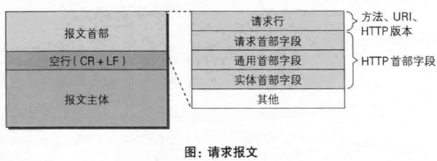
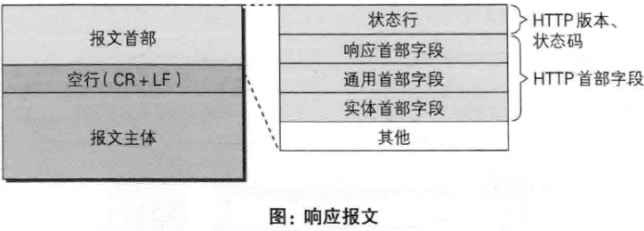
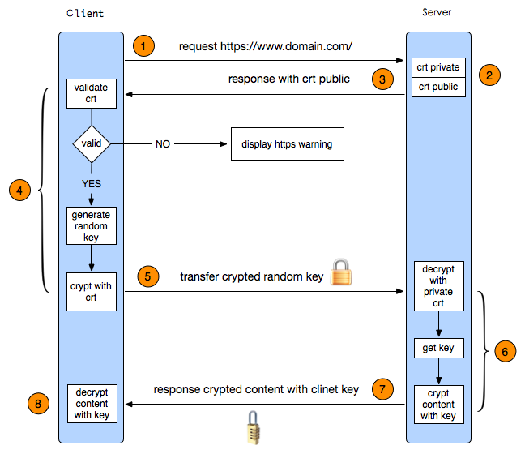

# HTTP面试题总结

http请求由三部分组成，分别是：请求行、消息报头、请求正文

HTTP（超文本传输协议）是一个基于请求与响应模式的、无状态的、应用层的协议，常基于TCP的连接方式，HTTP1.1版本中给出一种持续连接的机制，绝大多数的Web开发，都是构建在HTTP协议之上的Web应用。

## 常用的HTTP方法有哪些？

- GET： 用于请求访问已经被URI（统一资源标识符）识别的资源，可以通过URL传参给服务器。
- POST：用于传输信息给服务器，主要功能与GET方法类似，但一般推荐使用POST方式。
- PUT： 传输文件，报文主体中包含文件内容，保存到对应URI位置。
- HEAD： 获得报文首部，与GET方法类似，只是不返回报文主体，一般用于验证URI是否有效。
- DELETE：删除文件，与PUT方法相反，删除对应URI位置的文件。
- OPTIONS：查询相应URI支持的HTTP方法。


## GET方法与POST方法的区别

### 区别一：

get重点在从服务器上获取资源，post重点在向服务器发送数据；

### 区别二：

get传输数据是通过URL请求，以field（字段）= value的形式，置于URL后，并用"?"连接，多个请求数据间用"&"连接，如```http://127.0.0.1/Test/login.action?name=admin&password=admin```，这个过程用户是可见的；
post传输数据通过Http的post机制，将字段与对应值封存在请求实体中发送给服务器，这个过程对用户是不可见的；

### 区别三：

Get传输的数据量小，因为受URL长度限制，但效率较高；
Post可以传输大量数据，所以上传文件时只能用Post方式；

### 区别四：

get是不安全的，因为URL是可见的，可能会泄露私密信息，如密码等；
post较get安全性较高；
区别五：
get方式只能支持ASCII字符，向服务器传的中文字符可能会乱码。
post支持标准字符集，可以正确传递中文字符。


## HTTP请求报文与响应报文格式

### 请求报文包含三部分：
- 请求行：包含请求方法、URI、HTTP版本信息
- 请求首部字段
- 请求内容实体

### 响应报文包含三部分：
- 状态行：包含HTTP版本、状态码、状态码的原因短语
- 响应首部字段
- 响应内容实体

## 常见的HTTP相应状态码

### 返回的状态

- 1xx：指示信息--表示请求已接收，继续处理
- 2xx：成功--表示请求已被成功接收、理解、接受
- 3xx：重定向--要完成请求必须进行更进一步的操作
- 4xx：客户端错误--请求有语法错误或请求无法实现
- 5xx：服务器端错误--服务器未能实现合法的请求
- 200：请求被正常处理
- 204：请求被受理但没有资源可以返回
- 206：客户端只是请求资源的一部分，服务器只对请求的部分资源执行GET方法，相应报文中通过Content-Range指定范围的资源。
- 301：永久性重定向
- 302：临时重定向
- 303：与302状态码有相似功能，只是它希望客户端在请求一个URI的时候，能通过GET方法重定向到另一个URI上
- 304：发送附带条件的请求时，条件不满足时返回，与重定向无关
- 307：临时重定向，与302类似，只是强制要求使用POST方法
- 400：请求报文语法有误，服务器无法识别
- 401：请求需要认证
- 403：请求的对应资源禁止被访问
- 404：服务器无法找到对应资源
- 500：服务器内部错误
- 503：服务器正忙


## HTTP1.1版本新特性

- 默认持久连接节省通信量，只要客户端服务端任意一端没有明确提出断开TCP连接，就一直保持连接，可以发送多次HTTP请求
- 管线化，客户端可以同时发出多个HTTP请求，而不用一个个等待响应
- 断点续传原理


## 常见HTTP首部字段

### 通用首部字段（请求报文与响应报文都会使用的首部字段）
- Date：创建报文时间
- Connection：连接的管理
- Cache-Control：缓存的控制
- Transfer-Encoding：报文主体的传输编码方式

### 请求首部字段（请求报文会使用的首部字段）
- Host：请求资源所在服务器
- Accept：可处理的媒体类型
- Accept-Charset：可接收的字符集
- Accept-Encoding：可接受的内容编码
- Accept-Language：可接受的自然语言

### 响应首部字段（响应报文会使用的首部字段）

- Accept-Ranges：可接受的字节范围
- Location：令客户端重新定向到的URI
- Server：HTTP服务器的安装信息

### 实体首部字段（请求报文与响应报文的的实体部分使用的首部字段）
- Allow：资源可支持的HTTP方法
- Content-Type：实体主类的类型
- Content-Encoding：实体主体适用的编码方式
- Content-Language：实体主体的自然语言
- Content-Length：实体主体的的字节数
- Content-Range：实体主体的位置范围，一般用于发出部分请求时使用


## HTTP的缺点与HTTPS

- 通信使用明文不加密，内容可能被窃听
- 不验证通信方身份，可能遭到伪装
- 无法验证报文完整性，可能被篡改

HTTPS就是HTTP加上加密处理（一般是SSL安全通信线路）+认证+完整性保护


## HTTP优化

利用负载均衡优化和加速HTTP应用

利用HTTP Cache来优化网站


## Http与Https的区别：

Http与Https的区别：
HTTP 的URL 以http:// 开头，而HTTPS 的URL 以https:// 开头
HTTP 是不安全的，而 HTTPS 是安全的
HTTP 标准端口是80 ，而 HTTPS 的标准端口是443
在OSI 网络模型中，HTTP工作于应用层，而HTTPS 的安全传输机制工作在传输层
HTTP 无法加密，而HTTPS 对传输的数据进行加密
HTTP无需证书，而HTTPS 需要CA机构wosign的颁发的SSL证书

## 什么是Http协议无状态协议?怎么解决Http协议无状态协议?

无状态协议对于事务处理没有记忆能力，缺少状态意味着如果后续处理需要前面的信息。

也就是说，当客户端一次HTTP请求完成以后，客户端再发送一次HTTP请求，HTTP并不知道当前客户端是一个”老用户“。

可以使用Cookie来解决无状态的问题，Cookie就相当于一个通行证，第一次访问的时候给客户端发送一个Cookie，当客户端再次来的时候，拿着Cookie(通行证)，那么服务器就知道这个是”老用户“。

## URI和URL的区别

### URI

是uniform resource identifier，统一资源标识符，用来唯一的标识一个资源。

Web上可用的每种资源如HTML文档、图像、视频片段、程序等都是一个来URI来定位的
URI一般由三部组成：
- 访问资源的命名机制
- 存放资源的主机名
- 资源自身的名称，由路径表示，着重强调于资源。


### URL

URL是uniform resource locator，统一资源定位器，它是一种具体的URI，即URL可以用来标识一个资源，而且还指明了如何locate这个资源。

URL是Internet上用来描述信息资源的字符串，主要用在各种WWW客户程序和服务器程序上，特别是著名的Mosaic。
采用URL可以用一种统一的格式来描述各种信息资源，包括文件、服务器的地址和目录等。URL一般由三部组成：

- 协议(或称为服务方式)
- 存有该资源的主机IP地址(有时也包括端口号)
- 主机资源的具体地址。如目录和文件名等

### URN

uniform resource name，统一资源命名，是通过名字来标识资源，比如```mailto:java-net@java.sun.com```。

### 总结

URI是以一种抽象的，高层次概念定义统一资源标识，而URL和URN则是具体的资源标识的方式。URL和URN都是一种URI。笼统地说，每个 URL 都是 URI，但不一定每个 URI 都是 URL。这是因为 URI 还包括一个子类，即统一资源名称 (URN)，它命名资源但不指定如何定位资源。上面的 mailto、news 和 isbn URI 都是 URN 的示例。
在Java的URI中，一个URI实例可以代表绝对的，也可以是相对的，只要它符合URI的语法规则。而URL类则不仅符合语义，还包含了定位该资源的信息，因此它不能是相对的。

在Java类库中，URI类不包含任何访问资源的方法，它唯一的作用就是解析。

相反的是，URL类可以打开一个到达资源的流。


## HTTP请求报文与响应报文格式

### 请求报文包含四部分：
- 请求行：包含请求方法、URI、HTTP版本信息
- 请求首部字段
- 请求内容实体
- 空行



### 响应报文包含四部分：


- 状态行：包含HTTP版本、状态码、状态码的原因短语
- 响应首部字段
- 响应内容实体
- 空行



### 常见的首部：

#### 通用首部字段（请求报文与响应报文都会使用的首部字段）
- Date：创建报文时间
- Connection：连接的管理
- Cache-Control：缓存的控制
- Transfer-Encoding：报文主体的传输编码方式

#### 请求首部字段（请求报文会使用的首部字段）
- Host：请求资源所在服务器
- Accept：可处理的媒体类型
- Accept-Charset：可接收的字符集
- Accept-Encoding：可接受的内容编码
- Accept-Language：可接受的自然语言

#### 响应首部字段（响应报文会使用的首部字段）
- Accept-Ranges：可接受的字节范围
- Location：令客户端重新定向到的URI
- Server：HTTP服务器的安装信息

#### 实体首部字段（请求报文与响应报文的的实体部分使用的首部字段）
- Allow：资源可支持的HTTP方法
- Content-Type：实体主类的类型
- Content-Encoding：实体主体适用的编码方式
- Content-Language：实体主体的自然语言
- Content-Length：实体主体的的字节数
- Content-Range：实体主体的位置范围，一般用于发出部分请求时使用

## HTTPS工作原理

1. 首先HTTP请求服务端生成证书，客户端对证书的有效期、合法性、域名是否与请求的域名一致、证书的公钥（RSA加密）等进行校验；
1. 客户端如果校验通过后，就根据证书的公钥的有效， 生成随机数，随机数使用公钥进行加密（RSA加密）；
1. 消息体产生的后，对它的摘要进行MD5（或者SHA1）算法加密，此时就得到了RSA签名；
1. 发送给服务端，此时只有服务端（RSA私钥）能解密。
1. 解密得到的随机数，再用AES加密，作为密钥（此时的密钥只有客户端和服务端知道）。



具体的参考链接：http://blog.csdn.net/sean_cd/article/details/6966130

## 一次完整的HTTP请求所经历的7个步骤

一次完整的HTTP请求所经历的7个步骤
HTTP通信机制是在一次完整的HTTP通信过程中，Web浏览器与Web服务器之间将完成下列7个步骤：

### 建立TCP连接
在HTTP工作开始之前，Web浏览器首先要通过网络与Web服务器建立连接，该连接是通过TCP来完成的，该协议与IP协议共同构建 Internet，即著名的TCP/IP协议族，因此Internet又被称作是TCP/IP网络。HTTP是比TCP更高层次的应用层协议，根据规则， 只有低层协议建立之后才能，才能进行更层协议的连接，因此，首先要建立TCP连接，一般TCP连接的端口号是80。

### Web浏览器向Web服务器发送请求行

一旦建立了TCP连接，Web浏览器就会向Web服务器发送请求命令。例如：GET /sample/hello.jsp HTTP/1.1。

### Web浏览器发送请求头

浏览器发送其请求命令之后，还要以头信息的形式向Web服务器发送一些别的信息，之后浏览器发送了一空白行来通知服务器，它已经结束了该头信息的发送。

### Web服务器应答

客户机向服务器发出请求后，服务器会客户机回送应答， HTTP/1.1 200 OK ，应答的第一部分是协议的版本号和应答状态码。

### Web服务器发送应答头

正如客户端会随同请求发送关于自身的信息一样，服务器也会随同应答向用户发送关于它自己的数据及被请求的文档。

### Web服务器向浏览器发送数据

Web服务器向浏览器发送头信息后，它会发送一个空白行来表示头信息的发送到此为结束，接着，它就以Content-Type应答头信息所描述的格式发送用户所请求的实际数据。

### Web服务器关闭TCP连接

一般情况下，一旦Web服务器向浏览器发送了请求数据，它就要关闭TCP连接，然后如果浏览器或者服务器在其头信息加入了这行代码：
Connection:keep-alive

TCP连接在发送后将仍然保持打开状态，于是，浏览器可以继续通过相同的连接发送请求。保持连接节省了为每个请求建立新连接所需的时间，还节约了网络带宽。

建立TCP连接->发送请求行->发送请求头->（到达服务器）发送状态行->发送响应头->发送响应数据->断TCP连接

最具体的HTTP请求过程：http://blog.51cto.com/linux5588/1351007


## HTTP优化方案


- TCP复用：TCP连接复用是将多个客户端的HTTP请求复用到一个服务器端TCP连接上，而HTTP复用则是一个客户端的多个HTTP请求通过一个TCP连接进行处理。前者是负载均衡设备的独特功能；而后者是HTTP 1.1协议所支持的新功能，目前被大多数浏览器所支持。
- 内容缓存：将经常用到的内容进行缓存起来，那么客户端就可以直接在内存中获取相应的数据了。
- 压缩：将文本数据进行压缩，减少带宽
- SSL加速（SSL Acceleration）：使用SSL协议对HTTP协议进行加密，在通道内加密并加速
- TCP缓冲：通过采用TCP缓冲技术，可以提高服务器端响应时间和处理效率，减少由于通信链路问题给服务器造成的连接负担。


## 参考

- [HTTP面试题都在这里](https://www.jianshu.com/p/fca985f0b40d)
- [HTTP协议【详解】——经典面试题](http://www.cnblogs.com/sunny-sl/p/6529830.html)
