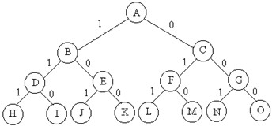
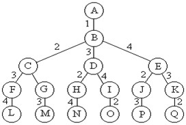

# 回溯之子集树和排列树

## 子集树

当所给的问题是从n个元素的集合S中找出满足某种性质的子集时，相应的解空间称为子集树。

例如，那个物品的0-1背包问题所相应的解空间树就是一颗子集树。这类子集问题通常有2^n个叶节点，其节点总个数为2^(n+1)-1。遍历子集树的任何算法均需要O(2^n)的计算时间。





```
void backtrack (int t)
{
    if (t>n) output(x);
    else
        for (int i=0;i<=n;i++) {
            x[t]=i;
            if (legal(t)) backtrack(t+1);
        }
}
```

## 排列树
当所给问题是确定n个元素满足某种性质的排列时，相应的解空间树称为排列树。排列树通常有n!个叶子节点。因此遍历排列树需要O(n!)的计算时间。




```
void backtrack (int t)
{
    if (t>n)
      output(x);
    else
      for (int i=t;i<=n;i++) {
        swap(x[t], x[i]);
        if (legal(t)) backtrack(t+1);
        swap(x[t], x[i]);
      }
}
```

更多：http://blog.csdn.net/liufeng_king/article/details/8762073

##  子集和问题

题目描述：子集和问题的一个实例为〈S,t〉。其中，S={ 1 x ， 2 x ，…， n x }是一个正整数的集合，c是一个正整数。子集和问题判定是否存在S的一个子集S1，使得s1中的各元素之和等于c。

## 参考

- [回溯之子集树和排列树（子集和问题）](http://www.cnblogs.com/youxin/p/4316325.html)
