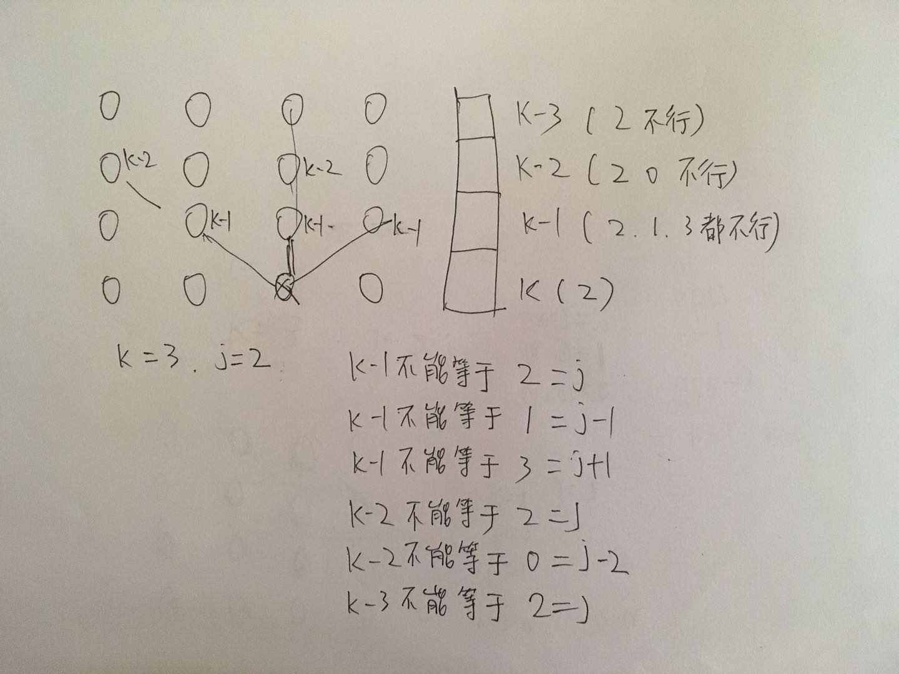

# 八皇后问题


## 八皇后问题描述：

八皇后问题，是一个古老而著名的问题，是回溯算法的典型案例：在8X8格的国际象棋棋盘上摆放八个皇后，使其不能互相攻击，即任意两个皇后都不能处于同一行、同一列或同一斜线上，问有多少种摆法。

## 八皇后问题求解：

采用回溯算法，即从第一行开始，依次探查可以放置皇后的位置，若找到，则放置皇后，开始探查下一行；若该行没有位置可以放置皇后，则回溯至上一行，清除该行放置皇后的信息，从该行原本放置皇后的下一个位置开始探查可以放置皇后的位置。求所有解时，每找到一组解，就清除这一组解最后一个皇后的位置信息，开始探查该行另外一个可以放置皇后的位置，依次回溯求解。


## 代码实现

我从网上下载了代码，但看不明白。把八皇后改成了四皇后，简单一些，下面是对这个的分析。

### 代码分析

这个代码对我来讲还是有点难度的，虽然对回溯法理解了，但看代码还是有难度，肯定是理解的不深刻。这个里面有几个难点要掌握的。

#### 1. 用一个数组表示结果

要想做八皇后，需要向明白用什么数据结构表达八皇后。

我的第一直觉是用二维数组表示，这个肯定能实现。

但这个代码里面，用的是数组。数组的长度是N，数组的每一位值表示其皇后的位置。

类似
```
1 3 0 2
```
表示第一个皇后放在第二个位置，第二个皇后放在第4个位置，如下图所示：


#### 2. 判断某一个位置能不能放的函数

这个函数说起来比较简单，就是判断某一个位置能不能放皇后，先放代码。
```
/**
 * 能否放一个皇后。
 *
 * @param k
 *            表示第几行
 * @param j
 *            表示第几个。
 * @return
 */
private boolean CanPlace(int k, int j) {
  System.out.println("call can place k=" + k + " j=" + j);

  for (int i = 1; i <= k; i++) {
    if (a[k - i] == j) {//j表示当前列
      System.out.println("  a[k - i] == j false " + j);
      return false;
    }
    if (a[k - i] == j - i) {
      System.out.println("  a[k - i] == j - i false " + (j - i));
      return false;
    }
    if (a[k - i] == j + i) {
      System.out.println("  a[k - i] == j + i false " + (j + i));
      return false;
    }

  }
  System.out.println("  true");
  return true;
}
```

这个代码被我改过了，为了分析其逻辑，加了一些输出。我把八皇后改成4皇后的时候，输出为：
```
m = 0
call can place k=0 j=0
  true
m = 1
call can place k=1 j=0
  a[k - i] == j false 0
call can place k=1 j=1
  a[k - i] == j - i false 0
call can place k=1 j=2
  true
m = 2
call can place k=2 j=0
  a[k - i] == j false 0
call can place k=2 j=1
  a[k - i] == j + i false 2
call can place k=2 j=2
  a[k - i] == j false 2
call can place k=2 j=3
  a[k - i] == j - i false 2
call can place k=1 j=3
  true
m = 2
call can place k=2 j=0
  a[k - i] == j false 0
call can place k=2 j=1
  true
m = 3
call can place k=3 j=0
  a[k - i] == j + i false 1
call can place k=3 j=1
  a[k - i] == j false 1
call can place k=3 j=2
  a[k - i] == j - i false 1
call can place k=3 j=3
  a[k - i] == j false 3
call can place k=2 j=2
  a[k - i] == j + i false 3
call can place k=2 j=3
  a[k - i] == j false 3
call can place k=0 j=1
  true
m = 1
call can place k=1 j=0
  a[k - i] == j + i false 1
call can place k=1 j=1
  a[k - i] == j false 1
call can place k=1 j=2
  a[k - i] == j - i false 1
call can place k=1 j=3
  true
m = 2
call can place k=2 j=0
  true
m = 3
call can place k=3 j=0
  a[k - i] == j false 0
call can place k=3 j=1
  a[k - i] == j - i false 0
call can place k=3 j=2
  true
八皇后的一组解为： 4
1302
*****************
call can place k=3 j=3
  a[k - i] == j false 3
call can place k=2 j=1
  a[k - i] == j false 1
call can place k=2 j=2
  a[k - i] == j + i false 3
call can place k=2 j=3
  a[k - i] == j false 3
call can place k=0 j=2
  true
m = 1
call can place k=1 j=0
  true
m = 2
call can place k=2 j=0
  a[k - i] == j false 0
call can place k=2 j=1
  a[k - i] == j - i false 0
call can place k=2 j=2
  a[k - i] == j false 2
call can place k=2 j=3
  true
m = 3
call can place k=3 j=0
  a[k - i] == j false 0
call can place k=3 j=1
  true
八皇后的一组解为： 4
2031
*****************
call can place k=3 j=2
  a[k - i] == j + i false 3
call can place k=3 j=3
  a[k - i] == j false 3
call can place k=1 j=1
  a[k - i] == j + i false 2
call can place k=1 j=2
  a[k - i] == j false 2
call can place k=1 j=3
  a[k - i] == j - i false 2
call can place k=0 j=3
  true
m = 1
call can place k=1 j=0
  true
m = 2
call can place k=2 j=0
  a[k - i] == j false 0
call can place k=2 j=1
  a[k - i] == j - i false 0
call can place k=2 j=2
  true
m = 3
call can place k=3 j=0
  a[k - i] == j false 0
call can place k=3 j=1
  a[k - i] == j + i false 2
call can place k=3 j=2
  a[k - i] == j false 2
call can place k=3 j=3
  a[k - i] == j - i false 2
call can place k=2 j=3
  a[k - i] == j false 3
call can place k=1 j=1
  true
m = 2
call can place k=2 j=0
  a[k - i] == j + i false 1
call can place k=2 j=1
  a[k - i] == j false 1
call can place k=2 j=2
  a[k - i] == j - i false 1
call can place k=2 j=3
  a[k - i] == j false 3
call can place k=1 j=2
  a[k - i] == j + i false 3
call can place k=1 j=3
  a[k - i] == j false 3
所有解的数量是：2

```


这个里面要理解的是循环，为了理解，我画了一张图，如下：


这个循环就是从这一行向上逐渐判断，基于上面的数组表示，很容易理解了。


### 最终代码实现

```
package com.zch.blogs.algorithm.topic;

/**
 * ## 问题描述：
 *
 * 八皇后问题，是一个古老而著名的问题，是回溯算法的典型案例：在8X8格的国际象棋棋盘上摆放八个皇后，使其不能互相攻击，即任意两个皇后都不能处于同一行、同一列或同一斜线上，问有多少种摆法。
 *
 * ## 问题求解：
 *
 * 采用回溯算法，即从第一行开始，依次探查可以放置皇后的位置，若找到，则放置皇后，开始探查下一行；若该行没有位置可以放置皇后，则回溯至上一行，清除该行放置皇后的信息，从该行原本放置皇后的下一个位置开始探查可以放置皇后的位置。求所有解时，每找到一组解，就清除这一组解最后一个皇后的位置信息，开始探查该行另外一个可以放置皇后的位置，依次回溯求解。
 *
 * @Description
 * @author zch
 * @time 2018年9月24日 下午10:20:42
 *
 */
public class EightQueens {
	private static final int COUNT = 4;
	private int[] a = new int[COUNT]; // 存储第i行皇后位于第a[i]列
	private static int count = 0;

	public static void main(String[] args) {
		EightQueens queen = new EightQueens();
		queen.Search(0);
		System.out.println("所有解的数量是：" + count);
	}

	public void Search(int m) {
		if (m >= COUNT) {
			System.out.println("八皇后的一组解为： ");
			count++;
			// printResult();
			print();
		} else {
//			System.out.println("m = " + m);
			for (int i = 0; i < COUNT; i++) {
				if (CanPlace(m, i)) {
					a[m] = i;
					Search(m + 1);

					a[m] = -10;
				}
			}
		}
	}

	/**
	 * 能否放一个皇后。
	 *
	 * @param k
	 *            表示第几行
	 * @param j
	 *            表示第几个。
	 * @return
	 */
	private boolean CanPlace(int k, int j) {
//		System.out.println("call can place k=" + k + " j=" + j);

		for (int i = 1; i <= k; i++) {
			if (a[k - i] == j) {//j表示当前列
//				System.out.println("  a[k - i] == j false " + j);
				return false;
			}
			if (a[k - i] == j - i) {
//				System.out.println("  a[k - i] == j - i false " + (j - i));
				return false;
			}
			if (a[k - i] == j + i) {
//				System.out.println("  a[k - i] == j + i false " + (j + i));
				return false;
			}

		}
//		System.out.println("  true");
		return true;
	}

	private void printResult() {
		for (int i = 0; i < COUNT; i++) {
			for (int j = 0; j < COUNT; j++) {
				if (a[i] == j) {
					System.out.print("Q");
				} else {
					System.out.print("0");
				}
			}
			System.out.println();
		}
		System.out.println("*****************");
	}

	private void print() {
		for (int i = 0; i < COUNT; i++) {
			System.out.print(a[i]);
		}
		System.out.println();
		System.out.println("*****************");
	}
}

```

## 输出

```
八皇后的一组解为：
1302
*****************
八皇后的一组解为：
2031
*****************
所有解的数量是：2


````

## 参考


- [八皇后问题][1]
- [五大常用算法之四：回溯法][2]
- [我的代码实现](https://github.com/wardensky/blogs/blob/master/00.source-code/blogs/algorithm/src/main/java/com/zch/blogs/algorithm/topic/EightQueens.java)

[1]:https://www.jianshu.com/p/1ad1026c5a8b
[2]:http://www.cnblogs.com/steven_oyj/archive/2010/05/22/1741376.html
