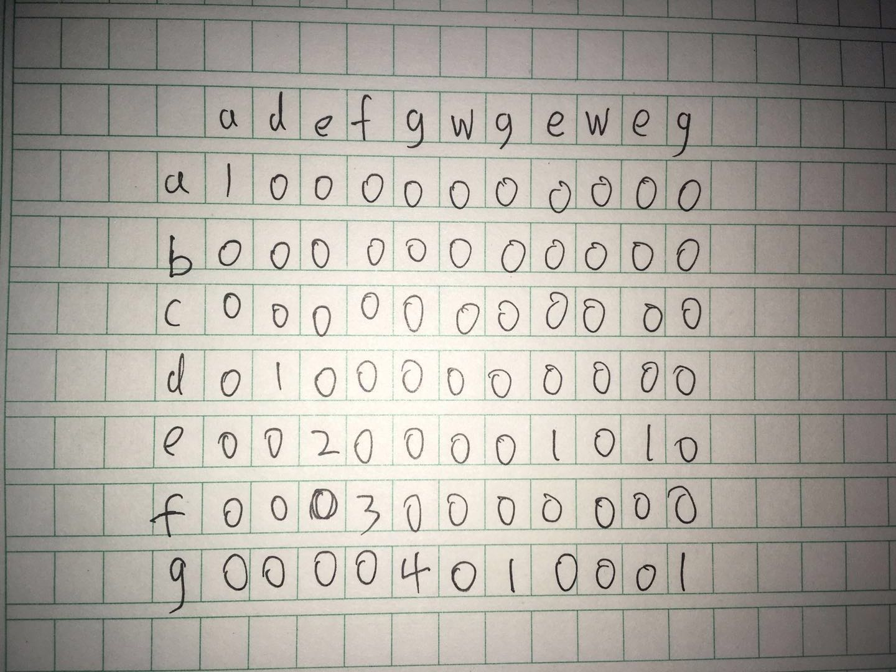

# 最长公共子串问题


## 题目

求两个字符串的最长公共子串，如“abcdefg”和“adefgwgeweg”的最长公共子串为“defg”（子串必须是连续的）

## 解析

用动态规划求解，其表格如下图。



## 代码实现

看明白上面这个图，代码还是很简单的。

这次代码基本上一次过，很难得。


```
package com.zch.blogs.algorithm.dynamic;

public class CommonString {

	public static void main(String[] args) {
		CommonString cs = new CommonString();
		String s1 = "abcdefg";
		String s2 = "adefgwgeweg";
		int[][] ret = cs.findCommon(s1.toCharArray(), s2.toCharArray());
		String finalRet = cs.findString(ret, s2.toCharArray());
		System.out.println(finalRet);
	}

	public String findString(int[][] a, char[] charA) {
		int max = -1;
		int index = -1;
		for (int i = 0; i < a.length; i++) {
			for (int j = 0; j < a[i].length; j++) {
				if (a[i][j] > max) {
					max = a[i][j];
					index = j;
				}
			}
		}
		StringBuilder sb = new StringBuilder();
		for (int i = index - max + 1; i <= index; i++) {
			sb.append(charA[i]);
		}

		return sb.toString();
	}

	public int[][] findCommon(char[] c1, char[] c2) {
		int[][] ret = new int[c1.length][c2.length];
		for (int i = 0; i < c1.length; i++) {
			for (int j = 0; j < c2.length; j++) {
				if (c1[i] != c2[j]) {
					ret[i][j] = 0;
				} else {
					if (i > 1 && j > 1 && ret[i - 1][j - 1] > 0) {
						ret[i][j] = ret[i - 1][j - 1] + 1;
					} else {
						ret[i][j] = 1;
					}
				}
			}

		}
		return ret;
	}
}

```

## 参考

- [算法图解]
- [求两个字符串的最长公共子串——Java实现](https://blog.csdn.net/xiaoyi357/article/details/70209164)
- [我的代码实现](https://)
