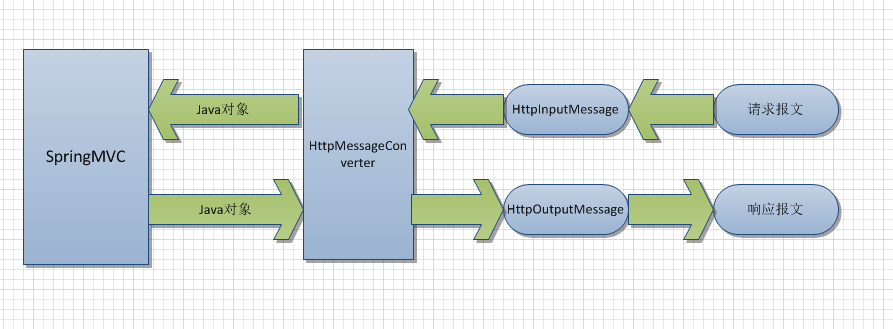

# SpringMVC @ResponseBody和@RequestBody使用


## @ResponseBody用法

### 作用

该注解用于将Controller的方法返回的对象，根据HTTP Request Header的Accept的内容,通过适当的HttpMessageConverter转换为指定格式后，写入到Response对象的body数据区。

### 使用时机

返回的数据不是html标签的页面，而是其他某种格式的数据时（如json、xml等）使用.
配置返回JSON和XML数据

添加jackson依赖
```
<dependency>
    <groupId>com.fasterxml.jackson.core</groupId>
    <artifactId>jackson-core</artifactId>
    <version>2.8.1</version>
</dependency>
<dependency>
    <groupId>com.fasterxml.jackson.core</groupId>
    <artifactId>jackson-databind</artifactId>
    <version>2.8.1</version>
</dependency>
```
开启<mvc:annotation-driven />

java代码为
```
 @RequestMapping("/testResponseBody")
    public @ResponseBody
    Person testResponseBody() {
        Person p = new Person();
        p.setName("xiaohong");
        p.setAge(12);
        return p;
    }
Person类

@XmlRootElement(name = "Person")
public class Person {
    private String name;
    private int age;
    public String getName() { return name;    }
    @XmlElement
    public void setName(String name) { this.name = name;    }
    public int getAge() { return age;    }
    @XmlElement
    public void setAge(int age) { this.age = age;    }
}
Ajax代码
$.ajax({
    url: "testResponseBody",
    type: 'GET',
    headers: {
        Accept: "application/xml",
//        Accept:"application/json",
    },
    success: function(data, textStatus){
        console.log(data);
        alert(data);
    },
    error: function (data, textStatus, errorThrown) {
        console.log(data);
    },
        });
```        
分析

如果没有配置Person类的XML注解,那么只会JSON数据,无论Accept是什么,

如果配置了Person类的xml注解,那么如果Accept含有applicatin/xml, 就会返回xml数据.例如通过浏览器直接访问,浏览器的http request header appect字段一般都为
Accept:text/html,application/xhtml+xml,application/xml;q=0.9,image/webp,*/*;q=0.8, 故返回XML数据.
改accept: "application/json",即可返回JSON数据.

用此注解或者ResponseEntity等类似类, 会导致response header含有accept-charset这个字段,而这个字段对于响应头是没有用的,以下方法可以关掉

<mvc:annotation-driven>
        <mvc:async-support default-timeout="3000"/>
        <!-- utf-8编码 -->
        <mvc:message-converters register-defaults="true">
            <bean class="org.springframework.http.converter.StringHttpMessageConverter">
                <constructor-arg value="UTF-8"/>
                <property name="writeAcceptCharset" value="false"/>
            </bean>
        </mvc:message-converters>
    </mvc:annotation-driven>

## @RequestBody使用

### 作用

注解用于将Controller的方法参数，根据HTTP Request Header的content-Type的内容,通过适当的HttpMessageConverter转换为JAVA类

### 使用时机

POST或者PUT的数据是JSON格式或者XML格式,而不是普通的键值对形式.

### 如何使用

其他代码同上, 配置Controller,如下:
```
@RequestMapping(value = "/testRequestBody", method= RequestMethod.POST)
    @ResponseBody
    public Person testRequestBody(@RequestBody Person p) {
        System.out.println("creating a employee:" + p);
        return p;
    }
```

Ajax代码如下:
```
 $.ajax({
    url: "testRequestBody",
    data: '{"name":"小红","age":12}', //要用双引号!!
    contentType: "application/json;charset=utf-8", // 因为上面是JSON数据

    type: "POST",
    headers: {
//                Accept: "application/xml",
        Accept: "application/json",
    },
    success: function(data, textStatus){
        console.log(data);
        alert(data);
    },
    error: function (data, textStatus, errorThrown) {
        console.log(data);
    },
});
```
xml类似.


## 参考

- [SpringMVC @ResponseBody和@RequestBody使用](https://www.jianshu.com/p/7097fea8ce3f)
- [Spring MVC之@RequestBody, @ResponseBody 详解](https://blog.csdn.net/kobejayandy/article/details/12690555)
