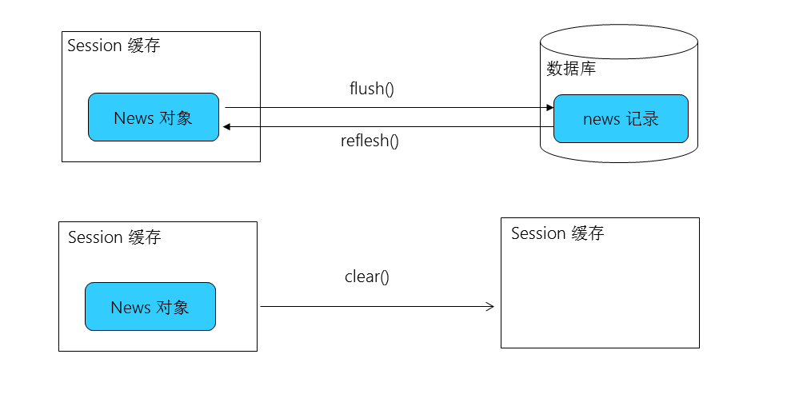

# Hibernate一级缓存——Session

## Session概述

Session接口是hibernate向应用程序提供的操纵数据库的最主要的接口，它提供了基本的保存，更新，删除和加载（不是查询）Java对象的方法。

Session具有一个缓存，位于缓存中的对象称为持久化对象，它和数据库中的相关记录对应。Session能够在某些时间点按照缓存中对象的变化来执行相关的SQL语句，来同步更新数据库。站在持久化的角度，Hibernate把对象分为4种状态：持久化状态，临时状态，游离状态和删除状态。Session的特定方法能使对象从一个状态到另一个状态。
　　

## Session缓存

在Session集合的实现中包含了一系列的Java集合，这些Java集合构成了Session缓存，只要Session实例没有结束生命周期，且没有清理缓存，则放在缓存中的对象也不会结束生命周期。利用Hibernate的这个一级缓存，能够减少Hibernate应用程序访问数据库的频率。
　　
操作Session缓存有以下几个方法：
　　
### flush()

Session按照缓存中对象的属性变化来同步更新数据库。这是为了使数据表中的记录和Session缓存中的对象的状态保持一致，为了保持一致，可能会发送对应的SQL语句（不代表会马上修改数据库，只有当事务提交后，才会修改数据库）。

默认情况下，Session在以下时间点刷新缓存：
1. 显式调用Session的flush()方法；
2. 当应用程序调用Transaction的commit()方法时，先调用Session的flush()方法，再提交事务；
3. 当应用程序执行一些查询（HQL,Criteria）操作时，如果缓存中持久化对象的属性已经发生了变化，会先flush缓存，以保证查询结果能够反映持久化对象的最新状态。

例外情况: 如果对象使用native生成器生成OID，那么当调用Session 的 save()方法保存对象时，会立即执行向数据库插入该实体的insert语句，因为在save()方法后，必须保证对象的OID是存在的，而由于配置了生成OID的方式为native，那么只有当执行insert语句后才能知道这个OID是多少。
　　
**commit() 和 flush() 方法的区别：**
- flush方法执行一系列sql语句，但不提交事务；
- commit方法先调用flush()方法，然后提交事务，只有提交事务才意味着对数据库操作永久保存下来。
　　

若希望改变 flush 的默认时间点, 可以通过Session的setFlushMode() 方法显式设定 flush 的时间点。（不常用）


　　
　　
### refresh()

refresh()方法会强制发送SELECT语句,以使Session缓存中对象的状态和数据表中对应的记录保持一致。

通常情况下，在进行一次查询后，由于session缓存，第二次查询时，将不再发送SQl语句，但是如果调用的refresh方法，则强制发送sql语句进行查询，以获取当前数据库记录的最新状态。
　　
### clear()

清理缓存。调用session.clear()后，缓存中的内容将被清空。

flush(),refresh()和clear()方法的示意图如下：


　　
　　
　　
补充：
在测试session的refresh方法时，使用了如下代码：
```
@Before
    public void init(){
        Configuration configuration =
        new Configuration().configure();

        ServiceRegistry serviceRegistry =
                new ServiceRegistryBuilder()
                .applySettings(configuration.getProperties())
                .buildServiceRegistry();

        sessionFactory = configuration
        .buildSessionFactory(serviceRegistry);

        session = sessionFactory.openSession();

        transaction = session.beginTransaction();
    }

    @After
    public void destroy(){
        transaction.commit();
        session.close();
        sessionFactory.close();
    }

@Test
    public void testRefresh(){
        News news = (News) session.get(News.class, 1);
        System.out.println(news);

        session.refresh(news);
        System.out.println(news);
    }
```    

在testRefresh()方法中的session.refresh(news); 语句前设置断点进行debug，当执行到这条语句之前时，我们手动修改数据库中的id为1的记录的值，然后按F6往下执行，会发现的确在refresh方法后又执行了一次select语句，但是输出的news的值却没有改变。如下图所示：


　　
这是由于mysql默认的事务隔离级别是REPETABLE_READ，即可重复读，这会确保事务可以多次从一个字段中读取相同的值，在这个事务持续期间，禁止其他事务对这个字段进行更新。所以我们无法看到测试效果，解决方法是在hibernate的配置文件中设置事务的隔离级别为READ_COMMITTED（编号为2）：

```
<!-- 设置 Hibernate 的事务隔离级别 -->
<property name="connection.isolation">2</property>
```

然后debug即可看到效果：


## 参考

- [Hibernate一级缓存——Session](https://blog.csdn.net/xiangwanpeng/article/details/53443781)
