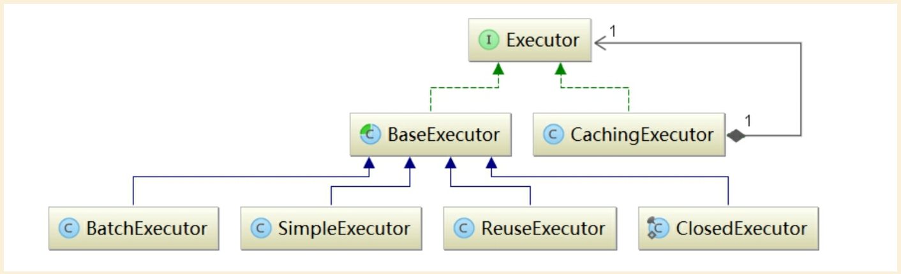

# Mybatis的Executor

## 简介

Executor是MyBatis的核心接口之一，其中定义了数据库操作的基本方法。在实际应用中经常涉及的SqlSession接口的功能，都是基于Executor接口实现的。Executor接口中定义的方法如下：

## 类图如下

## BaseExecutor

SimpleExecutor：每执行一次update或select，就开启一个Statement对象，用完立刻关闭Statement对象。（可以是Statement或PrepareStatement对象）

ReuseExecutor：执行update或select，以sql作为key查找Statement对象，存在就使用，不存在就创建，用完后，不关闭Statement对象，而是放置于Map<String, Statement>内，供下一次使用。（可以是Statement或PrepareStatement对象）,代码如下：

## CachingExecutor

## SimpleExecutor

## BatchExecutor

## ReUseExecutor

## ClosedExecutor

## 参考
