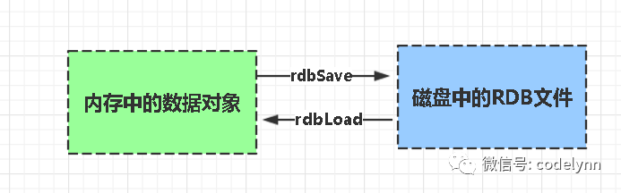

# Redis持久化

持久化就是把内存的数据写到磁盘中去，防止服务宕机了内存数据丢失。
Redis 提供了两种持久化方式:RDB（默认） 和AOF

**RDB**

rdb是Redis DataBase缩写
功能核心函数

rdbSave(生成RDB文件)和rdbLoad（从文件加载内存）两个函数

**AOF**

Aof是Append-only file缩写

每当执行服务器(定时)任务或者函数时flushAppendOnlyFile 函数都会被调用， 这个函数执行以下两个工作

aof写入保存：

WRITE：根据条件，将 aof_buf 中的缓存写入到 AOF 文件

SAVE：根据条件，调用 fsync 或 fdatasync 函数，将 AOF 文件保存到磁盘中。

存储结构:

内容是redis通讯协议(RESP )格式的命令文本存储。

比较：
aof文件比rdb更新频率高，优先使用aof还原数据。
aof比rdb更安全也更大
rdb性能比aof好

如果两个都配了优先加载AOF
