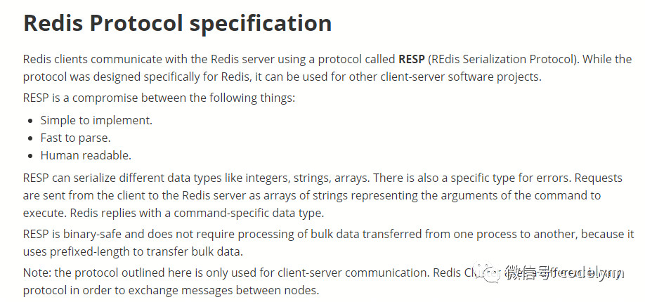

# Redis通信协议

RESP 是redis客户端和服务端之前使用的一种通讯协议；

RESP 的特点：
实现简单、快速解析、可读性好

For Simple Strings the first byte of the reply is “+” 回复
For Errors the first byte of the reply is “-” 错误
For Integers the first byte of the reply is “:” 整数
For Bulk Strings the first byte of the reply is “$” 字符串
For Arrays the first byte of the reply is “” 数组
