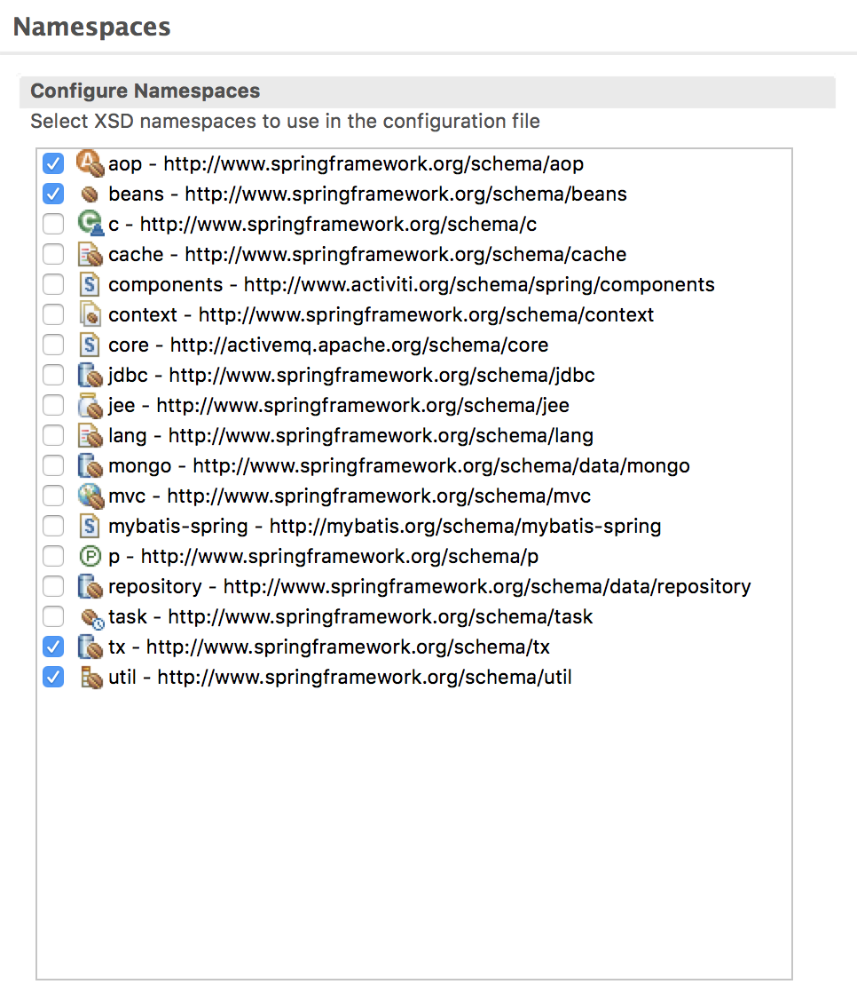

# Spring入门（3）-Spring命名空间与Bean作用域

这篇文章主要介绍Spring的命名空间和Bean作用域


## 1. Spring命名空间

在前面的文章中，Spring的配置文件中定义了beans，除了beans之外，Spring还定义了其他的命名空间，如下：


|命名空间|用途|
|-|-|
|aop|为声明切面以及将@AspectJ注解的类代理为Spring切面提供了配置元素|
|beans|支持声明Bean和装配Bean，是Spring最核心也是最原始的命名空间|
|context|为配置Spring应用上下文提供了配置元素，包括自动检测和自动装配Bean、注入非Spring直接管理的对象|
|jee|提供了与Java EE API的集成，例如JNDI和EJB|
|jms|为声明消息驱动的POJO提供了配置元素|
|lang|支持配置由Groovy、JRuby或BeanShell等脚本实现的Bean|
|mvc|启动Spring MVC的能力，例如面向注解的控制器、视图控制器和拦截器|
|oxm|支持Spring的对象到XML映射配置|
|tx|提供声明式事务配置|
|util|提供各种各样的工具类元素，包括把集合配置为Bean、支持属性占位符元素|


也可以看下图


上图是我从自己的eclipse里面截图得到的。

bean例子

```
<bean id="transactionManager" class="org.springframework.orm.hibernate3.HibernateTransactionManager">
<property name="sessionFactory" ref="sessionFactory" />
</bean>
```

AOP例子

```
<aop:aspectj-autoproxy proxy-target-class="true"/>

<aop:config>
       <aop:pointcut id="serviceMethods" expression="execution(* com.wisdombud.szxtyms.business.*.impl.*.*(..)) || execution(* com.wisdombud.szxtyms.business.*.*.*(..)) || execution(* com.wisdombud.szxtyms.business.*.*.impl.*.*(..))" />
       <aop:advisor advice-ref="txAdvice" pointcut-ref="serviceMethods" />
   </aop:config>
```

context例子
```
<context:annotation-config />
```

事务例子
```
<tx:annotation-driven transaction-manager="transactionManager" proxy-target-class="true" />


<!-- 通知 默认事务管理器：transaction-manager="transactionManager" -->
    <tx:advice id="txAdvice" transaction-manager="transactionManager">
       <tx:attributes>
            <tx:method name="find*" read-only="true" />
            <tx:method name="page*" read-only="true" />
            <tx:method name="list*" read-only="true" />
            <tx:method name="get*" read-only="true" />
            <tx:method name="plot*" read-only="true" />
            <tx:method name="login*" propagation="REQUIRED" read-only="true" />
            <tx:method name="set*" propagation="REQUIRED" rollback-for="common.toolkit.java.exception" />
            <tx:method name="start*" propagation="REQUIRED" rollback-for="common.toolkit.java.exception" />
            <tx:method name="deploy*" propagation="REQUIRED" rollback-for="common.toolkit.java.exception" />
            <tx:method name="process*" propagation="REQUIRED" rollback-for="common.toolkit.java.exception" />
            <tx:method name="batch*" propagation="REQUIRED" rollback-for="common.toolkit.java.exception" />
            <tx:method name="audit*" propagation="REQUIRED" rollback-for="common.toolkit.java.exception" />
            <tx:method name="add*" propagation="REQUIRED" rollback-for="common.toolkit.java.exception" />
            <tx:method name="save*" propagation="REQUIRED" rollback-for="common.toolkit.java.exception" />
            <tx:method name="update*" propagation="REQUIRED" rollback-for="common.toolkit.java.exception" />
            <tx:method name="merge*" propagation="REQUIRED" rollback-for="common.toolkit.java.exception" />
            <tx:method name="edit*" propagation="REQUIRED" rollback-for="common.toolkit.java.exception" />
            <tx:method name="delete*" propagation="REQUIRED" rollback-for="common.toolkit.java.exception" />
            <tx:method name="send*" propagation="REQUIRED" rollback-for="common.toolkit.java.exception" />
            <tx:method name="copy*" propagation="REQUIRED" rollback-for="common.toolkit.java.exception" />
            <tx:method name="*" read-only="true" />
        </tx:attributes>
    </tx:advice>
```

## 2. Bean作用域

所有的Spring Bean默认都是单例。但除了单例之外，我们可能有别的需求，比如说多个实例。在Bean的声明中，把scope设置为prototype即可，如下：

```
<?xml version="1.0" encoding="UTF-8"?>
<beans xmlns="http://www.springframework.org/schema/beans"
	xmlns:xsi="http://www.w3.org/2001/XMLSchema-instance"
	xsi:schemaLocation="http://www.springframework.org/schema/beans
http://www.springframework.org/schema/beans/spring-beans.xsd">
	<bean  name="PersonBll" class="com.chzhao.springtest.PersonBll"
   scope="prototype"></bean>
</beans>
```

除了prototype之外，Spring还定义了另外的作用域，如下表所示。

|作用域|定义|
|---|---|
|singleton|单例|
|prototype|每次调用创建一个实例|
|request|一次http请求对应一个实例|
|session|一个session对应一个实例|
|gobal-session|在全局的http session中，每个bean定义对应一个实例|


下面的代码能说明singleton和prototype的区别。


```

<?xml version="1.0" encoding="UTF-8"?>
<beans xmlns="http://www.springframework.org/schema/beans"
	xmlns:xsi="http://www.w3.org/2001/XMLSchema-instance"
	xsi:schemaLocation="http://www.springframework.org/schema/beans http://www.springframework.org/schema/beans/spring-beans.xsd">
	<bean name="PersonBll" class="com.zch.spring_code_demo.demo1.PersonBll"
		scope="prototype"></bean>
</beans>


```


```
package com.zch.spring_code_demo.demo3;

import java.util.HashSet;
import java.util.Set;

import org.springframework.context.ApplicationContext;
import org.springframework.context.support.ClassPathXmlApplicationContext;

import com.zch.spring_code_demo.demo1.IPersonBll;

public class App {
	public static void main(String[] args) {
		ApplicationContext act = new ClassPathXmlApplicationContext("demo3.xml");

		Set<IPersonBll> set = new HashSet<IPersonBll>();
		for (int i = 0; i < 10; i++) {
			IPersonBll pbll1 = (IPersonBll) act.getBean("PersonBll");
			set.add(pbll1);
		}
		///如果是singleton，打印的是1，如果是prototype，打印的是10
		System.out.println(set.size());
		((ClassPathXmlApplicationContext) act).close();
	}
}

```


## 3. 源码


[源代码](https://github.com/wardensky/blogs/tree/master/7.framework/spring/source-code/spring-code-demo/src/main/java/com/zch/spring_code_demo/demo3)
